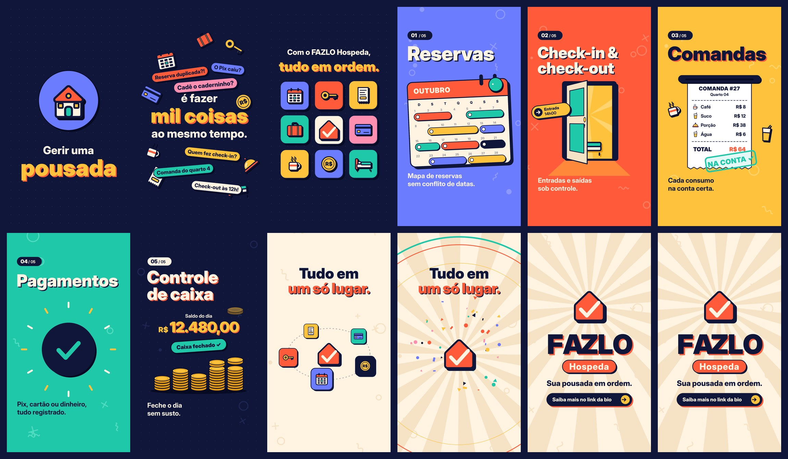

# FAZLO Hospeda — Motion Graphics para Reels

Vídeo publicitário vertical **9:16 (1080×1920), 28 s, 60 fps, H.264 + AAC**, feito só com formas, ícones, tipografia e movimento. Não aparece nenhuma tela, interface, celular ou computador.

▶ **Vídeo final:** [`output/fazlo-hospeda-reels.mp4`](output/fazlo-hospeda-reels.mp4)
🖼 Capa: [`output/capa.png`](output/capa.png) · Storyboard: [`output/storyboard.jpg`](output/storyboard.jpg)



---

## Conceito: “do caos à ordem”

Quem administra uma pousada vive no meio de muitas pequenas urgências: reserva duplicada, hóspede chegando, comanda do quarto 4, o Pix que ainda não caiu, o caixa para fechar. O vídeo começa nesse caos e, com a entrada da marca, tudo **se encaixa no lugar**. Cada peça vira um bloco organizado, e cada bloco apresenta uma função do produto.

A assinatura é **“Sua pousada em ordem.”**

## Direção de arte

- **Estilo:** flat com traço grosso, contorno escuro e *sombra dura* deslocada (um neo-brutalismo amigável). É chamativo no feed, legível em tela pequena e transmite organização sem ficar frio.
- **Paleta:** quente e hospitaleira, com contraste forte.

  | Cor | Hex | Uso |
  |---|---|---|
  | Tinta | `#10163A` | fundo do caos e do caixa, contornos, texto |
  | Coral | `#FF5B3A` | cor principal da marca, check-in |
  | Sol | `#FFC23C` | destaques, comandas, moedas |
  | Turquesa | `#1FC8A9` | confirmação (check), pagamentos |
  | Violeta | `#6C7CFF` | reservas |
  | Creme | `#FFF3E2` | papel, fundo do final |

- **Tipografia:** Inter Display (Black/ExtraBold/Bold), em tamanho grande e espaçamento apertado, com entradas mascaradas (o texto “sobe” de trás de uma linha invisível).
- **Marca criada para a peça:** uma casinha (a pousada) com um *check* dentro, para dizer “pousada em ordem”.

## Roteiro / linha do tempo (120 BPM, cortes no tempo da música)

| Tempo | Cena | O que acontece |
|---|---|---|
| 0–2 s | **Gancho** | Uma casinha surge num círculo: “Gerir uma **pousada**”. No 1º tempo forte ela explode em ícones (chave, calendário, comanda, moeda…). |
| 2–5 s | **Caos** | “é fazer **mil coisas** ao mesmo tempo.” Etiquetas pipocam a cada ¼ de tempo (“Reserva duplicada?!”, “O Pix caiu?”, “Cadê o caderninho?”). A tela treme cada vez mais e um *riser* sobe. |
| 5–7 s | **Ordem** | *Drop*: flash, onda de choque e a marca FAZLO bate no centro. As etiquetas são varridas e os ícones se encaixam numa grade 3×3. “Com o FAZLO Hospeda, **tudo em ordem.**” A câmera mergulha no bloco do calendário. |
| 7–9,5 s | **01 Reservas** | Um calendário de papel sobe e as faixas de reserva deslizam sem se sobrepor. Selo de check. |
| 9,5–12 s | **02 Check-in & check-out** | A chave entra, gira, e a porta abre em perspectiva para um quarto iluminado. Aparecem as etiquetas *Entrada 14h00* e *Saída 12h00*. A luz da porta vira a transição. |
| 12–14,5 s | **03 Comandas** | Uma comanda “imprime” item por item, mostra o total e leva o carimbo **NA CONTA ✓**. |
| 14,5–17 s | **04 Pagamentos** | Cartão, Pix, cédula e moedas entram e são sugados para um grande ✓: **PAGO!** O círculo se expande para a cena seguinte. |
| 17–19,5 s | **05 Controle de caixa** | Moedas caem e formam pilhas enquanto o saldo sobe até R$ 12.480,00. Selo *Caixa fechado ✓*. |
| 19,5–23 s | **Tudo em um só lugar** | Os 5 módulos orbitam a marca, aceleram e se fundem nela. Explosão de confete. |
| 23–28 s | **Assinatura** | FAZLO letra por letra, a pílula *Hospeda*, “Sua pousada em ordem.” e o CTA “Saiba mais no link da bio”. |

O texto importante fica fora das áreas cobertas pela interface do Reels (topo e rodapé).

## Som

A trilha e todos os efeitos foram **sintetizados do zero** em Python (numpy/scipy), sem nenhum sample externo: house/pop a 120 BPM com bumbo, palmas, chimbal, baixo pulsante com *side-chain*, pad e arpejo. Os efeitos ficam sincronizados com a animação: *pops*, *whooshes*, *riser*, impactos, clique da chave, “impressora”, tilintar de moedas e o *ding* de confirmação. O áudio sai em cerca de −14 LUFS, o nível de referência das redes sociais.

## Arquivos-fonte

```
src/
  index.html      # player de preview (play/scrub com áudio) e página usada no render
  anim.js         # TODO o motion: cenas, ícones vetoriais, tipografia, transições
  fonts/          # Inter Display (licença OFL, ver LICENSE-Inter.txt)
scripts/
  audio.py        # gera audio/trilha.wav (trilha + efeitos sincronizados)
  render.cjs      # renderiza quadro a quadro (Chromium headless) -> ffmpeg -> MP4
audio/trilha.wav
output/           # vídeo final, capa e storyboard
```

A animação é **determinística**: `FAZLO.renderAt(ctx, t)` desenha o quadro exato do instante `t`. Por isso o preview e o render final saem idênticos e qualquer quadro pode ser exportado.

### Como renderizar

Requisitos: Node 18+, Playwright (Chromium), ffmpeg, Python 3 com numpy e scipy.

```bash
python3 scripts/audio.py                       # 1) trilha sonora
node scripts/render.cjs video --fps 60         # 2) vídeo final em output/
node scripts/render.cjs stills 5.5,24.9        # (opcional) quadros avulsos em PNG
```

### Preview interativo

```bash
npx serve .        # ou qualquer servidor estático na raiz do repositório
# abra http://localhost:3000/src/index.html  (?t=12.5 abre num instante específico)
```

### Onde editar

- Textos, cores e tempos de cada cena ficam nas funções `scene*` de `src/anim.js`.
- A paleta está no objeto `C`, no topo do arquivo.
- Cortes e transições ficam em `SCENES` e `TRANS`, no fim do arquivo. Se mudar algum tempo, ajuste também os efeitos correspondentes em `scripts/audio.py`.
