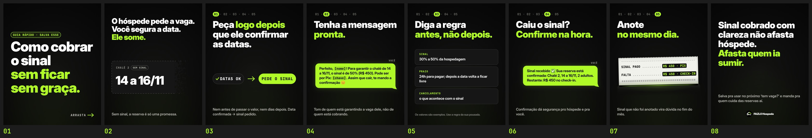

# FAZLO Hospeda — Carrossel 01 · Pilar DICA · "Como cobrar o sinal sem constrangimento"

Carrossel estático para o Instagram, para ser salvo e compartilhado por donos de pousada. Não mostra telas do sistema e não tem CTA de venda. Postagem prevista: quinta-feira, 15/10.

**Status:** prévia para aprovação.

**Formato:** 8 slides 1080×1350 (4:5), PNG · margem de 80 px nas laterais (a grade do perfil mostra o centro 3:4 do post, cortando ~34 px de cada lado).

▶ **Slides:** [`output/01.png`](output/01.png) … [`output/08.png`](output/08.png) · **Prévia:** [`output/previa.jpg`](output/previa.jpg) · Revisão: [`output/revisao/`](output/revisao)



## DNA (o mesmo dos Reels)

- Fundo `#0A0A0A` com o brilho suave da série; verde-limão `#AFFA27`; branco nos títulos; apoio em cinza `#B9B9B1`.
- **Inter Display 900** nos títulos (tracking −0,03 em); Inter Display 600/700 no apoio e nas bolhas; **JetBrains Mono NL** nos chips, rótulos e dados.
- Cards `#161616` com borda `#3A3A3A`.
- **Hierarquia fixa:** título grande no terço superior, conteúdo centrado na faixa do meio, apoio embaixo. O título usa o maior corpo que cabe na caixa.

## Mecânicas

- **Trilha de passos** (slides 3–7): "01 · 02 · 03 · 04 · 05" em mono; o passo atual aceso numa pílula limão, os outros em cinza. As casas têm largura fixa: os números ficam no mesmo lugar ao arrastar.
- **Bolhas do dono da pousada** (slides 4 e 6): limão com texto preto, cantos arredondados e um rabicho discreto; etiqueta "VOCÊ" em mono. Genéricas, no DNA da marca: sem o verde, os tiques ou o layout de app de mensagens. Os campos a preencher (`[nome]`, `[chave]`) aparecem em mono, marcados.
- **A notinha do Reel 07** (slide 7): o mesmo desenho do vídeo — papel térmico `#F2F2EC` com fibras e borda serrilhada, réguas tracejadas, valor impresso em negativo (bloco preto, texto limão) e a fenda acesa da impressora — como componente reutilizável em [`src/notinha.js`](src/notinha.js). O Reel 07 não foi alterado.

## Os slides

| # | Título | Meio | Apoio |
|---|---|---|---|
| 01 | "Como cobrar o sinal" / "sem ficar sem graça." (limão) | chip "GUIA RÁPIDO · SALVA ESSE" | "ARRASTA →" |
| 02 | "O hóspede pede a vaga. Você segura a data." / "Ele some." (limão) | card tracejado da reserva (CHALÉ 2 · SEM SINAL · 14 a 16/11) que se desfaz na ponta | "Sem sinal, a reserva é só uma promessa." |
| 03 | "Peça **logo depois** que ele confirmar as datas." | chips "✓ DATAS OK" → "PEDE O SINAL" | "Nem antes de passar o valor, nem dias depois. Data confirmada → sinal pedido." |
| 04 | "Tenha a mensagem **pronta.**" | bolha com a mensagem do sinal | "Tom de quem está garantindo a vaga dele, não de quem está cobrando." |
| 05 | "Diga a regra" / "**antes, não depois.**" | 3 cards: SINAL · PRAZO · CANCELAMENTO | nota: "Os valores são exemplos. Use a regra da sua pousada." |
| 06 | "Caiu o sinal?" / "**Confirme na hora.**" | bolha com a confirmação | "Confirmação dá segurança pro hóspede e pra você." |
| 07 | "Anote" / "**no mesmo dia.**" | a notinha: SINAL PAGO … R$ 450 · PIX / FALTA … R$ 450 · CHECK-IN | "Sinal que não foi anotado vira dúvida no fim do mês." |
| 08 | "Sinal cobrado com clareza não afasta hóspede." / "**Afasta quem ia sumir.**" | — | "Salva pra usar no próximo ‘tem vaga?’ e manda pra quem cuida das reservas aí." + logo pequena |

(Em negrito: o trecho em limão.)

## Revisão

`python3 scripts/previa.py` gera a prévia e confere, pelos pixels, que nada além do fundo passa da margem de 80 px ([`margens.txt`](output/revisao/margens.txt), [`margens.jpg`](output/revisao/margens.jpg) com a margem em azul e o corte da grade em vermelho) e mostra o slide 1 na grade do perfil, em miniatura, ao lado das capas dos Reels 07 e 06 ([`capa-na-grade.jpg`](output/revisao/capa-na-grade.jpg)).

## Arquivos-fonte

```
carrosseis/carrossel-01/
  src/
    index.html      # prévia no navegador (os 8 lado a lado) e página usada no render
    slides.js       # os 8 slides: layout, título que se ajusta à caixa, trilha, bolhas, cards, chips
    notinha.js      # a notinha do Reel 07 como componente
    assets/         # logo oficial (sem alteração) + versão sem o fundo branco externo
    fonts/          # Inter Display + JetBrains Mono NL (licença OFL)
  scripts/
    render.cjs      # Chromium headless -> output/01.png … 08.png
    previa.py       # prévia lado a lado + revisão de margens e da capa na grade
  output/
    01.png … 08.png
    previa.jpg
    revisao/
```

```bash
cd carrosseis/carrossel-01
node scripts/render.cjs          # os 8 slides (ou: node scripts/render.cjs 3,7)
python3 scripts/previa.py        # prévia e revisão
```

Requisitos: Node 18+, Playwright (Chromium), Python 3 com numpy e Pillow. Os emojis das bolhas (😊, ✅) usam a fonte de emoji do sistema (Noto Color Emoji no render).
