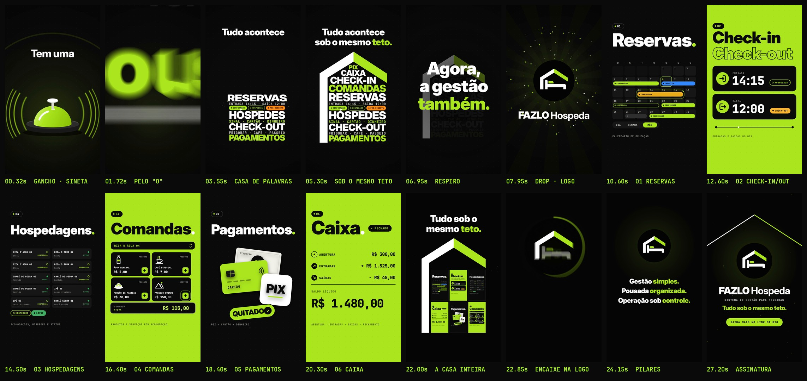

# FAZLO Hospeda — Reel 00 · "Sob o mesmo teto."

Primeiro vídeo da nova série de Reels: a apresentação do FAZLO Hospeda. Conceito, narrativa, animação e trilha são novos; a V2 ([`../../v2`](../../v2)) foi a referência de qualidade, não de roteiro. Os vídeos anteriores continuam intactos.

**Formato:** 9:16 (1080×1920), **28,2 s**, 60 fps, H.264 + AAC 48 kHz, áudio em −14 LUFS.

▶ **Vídeo:** [`output/fazlo-hospeda-reel-00.mp4`](output/fazlo-hospeda-reel-00.mp4)
🖼 **Capa:** [`output/capa.png`](output/capa.png) · Storyboard: [`output/storyboard.jpg`](output/storyboard.jpg) · Revisão: [`output/revisao/`](output/revisao)



---

## Conceito: "Sob o mesmo teto."

Numa pousada, tudo acontece debaixo de um mesmo teto: a reserva, o hóspede que chega, o consumo, o pagamento, o caixa do dia. A proposta do FAZLO Hospeda é levar a **gestão** para o mesmo lugar. O vídeo conta isso com o próprio desenho da logo: **o telhado** (braço esquerdo branco, braço direito limão, 33°) vira o elemento que costura o filme.

1. Uma sineta de recepção toca: **"Tem uma pousada?"**
2. As palavras da operação real (reservas, check-in, comandas, Pix, caixa…) caem uma a uma e **constroem uma casa**. O telhado fecha: **"Tudo acontece sob o mesmo teto."**
3. Silêncio. **"Agora, a gestão também."** Tudo é sugado para um ponto e…
4. **Drop:** a logo explode na tela. *FAZLO Hospeda · Sistema de gestão para pousadas.*
5. A câmera **mergulha dentro da casa da logo** e percorre **seis cômodos**, um por módulo.
6. Ela recua e revela que **todos os cômodos estavam sob o mesmo teto**. A casa se encaixa, ponto a ponto, na logo oficial.
7. **Gestão simples. Pousada organizada. Operação sob controle.** Assinatura e CTA.

O texto do vídeo não promete nada além do que o produto faz: os pilares finais repetem a proposta do próprio FAZLO Hospeda (simplificar a administração, organizar, dar controle da operação). Não há números de resultado, ganhos de tempo, integrações ou funções que as telas não mostram.

## Roteiro (128 BPM · 1 compasso = 1,875 s)

| Tempo | Compasso | Cena | O que acontece |
|---|---|---|---|
| 0–1,9 s | 1 | **Gancho** | A sineta já está em cena no 1º quadro e toca duas vezes (*ding-ding*), com ondas sonoras. "Tem uma" sobe; **"pousada?"** bate no 2º tempo. A câmera mergulha pelo miolo do "o". |
| 1,9–5,6 s | 2–3 | **Casa de palavras** | Doze linhas caem em colcheias, de baixo para cima, e formam uma casa (cada aterrissagem com poeira e um tom que sobe na escala). O telhado despenca e fecha a casa: **"Tudo acontece sob o mesmo teto."** |
| 5,6–7,5 s | 4 | **Respiro** | A música para, a casa apaga. **"Agora, / a gestão / também."**, uma linha por tempo. Tudo gira e é sugado para um ponto. |
| 7,5–9,4 s | 5 | **Drop · logo** | Explosão (ondas de choque, raios, partículas) e a logo entra. **FAZLO Hospeda** e "Sistema de gestão para pousadas". A câmera mergulha no interior preto da casa da logo. |
| 9,4–11,3 s | 6 | **01 Reservas** | Calendário de outubro de 2026 em cascata; os períodos são pintados com as cores de status do app; a pré-reserva vira **CONFIRMADA ✓**. Dia · Semana · **Mês**. |
| 11,3–13,1 s | 7 | **02 Check-in / Check-out** | Entrada **14:15** e saída **12:00** em dígitos que rolam; CHECK-IN vira **HOSPEDADA**. |
| 13,1–15,0 s | 8 | **03 Hospedagens** | As dez acomodações (Bica D'Água, Chalé de Pedra, Ipê, Chalé Serra) viram uma a uma e acendem o status. |
| 15,0–16,9 s | 9 | **04 Comandas** | Água, café, porção de pastéis e passeio guiado: cada **+** lança o item na comanda da Bica D'Água 04, que soma até R$ 200,00. |
| 16,9–18,8 s | 10 | **05 Pagamentos** | Cartão, Pix e dinheiro entram de três direções; o carimbo **QUITADO ✓** bate. |
| 18,8–20,6 s | 11 | **06 Caixa** | Abertura, entradas e saídas contam; **saldo líquido R$ 1.480,00**; ABERTO vira **FECHADO ✓**. |
| 20,6–22,5 s | 12 | **A casa inteira** | Recuo: os seis cômodos aparecem lado a lado; telhado e parede batem em cima: **"Tudo sob o mesmo teto."** |
| 22,5–24,4 s | 13 | **Encaixe + pilares** | A casa encolhe e o telhado coincide com o da logo; os cômodos se recolhem onde fica a cama e um anel limão fecha o círculo. **Gestão simples. Pousada organizada. Operação sob controle.** |
| 24,4–28,2 s | 14–15 | **Assinatura** | Sineta + golpe final. Telhado fino emoldurando a logo, **FAZLO Hospeda**, "Sistema de gestão para pousadas", **"Tudo sob o mesmo teto."** e o CTA **"Saiba mais no link da bio"**. Um brilho atravessa o nome no último acorde. |

Transições: zoom através da letra, implosão/explosão, mergulho na logo, **pans de câmera entre cômodos** (o mundo é contínuo: os seis módulos são painéis de uma mesma casa) e o recuo/encaixe final. As passagens rápidas usam **motion blur real** (até 30 subamostras por quadro).

## Direção de arte

- **Identidade do produto:** preto, verde-limão `#AFFA27` (amostrado da logo) e branco. Os cômodos alternam preto e limão, formando um xadrez quando a casa aparece inteira.
- **Cores de status do app** com a mesma função: limão (confirmada), laranja (pré-reserva), azul (check-in), preto com contorno limão (hospedada), âmbar (check-out), verde (livre), cinza (bloqueada).
- **Tipografia:** Inter Display Black nos títulos (grandes, com entrada mascarada) e JetBrains Mono nos dados, horários e valores, como no produto.
- **Logo:** sempre o arquivo oficial, sem alteração (`scripts/logo_alpha.py` só torna transparente o branco *fora* do círculo). O telhado animado foi **medido na própria arte** (vértices em pixels da imagem), por isso a casa se encaixa exatamente na logo antes de a imagem oficial assumir.
- **Sem telas, celulares ou computadores.** Nomes, horários e valores são os dados de demonstração das capturas do app (Bica D'Água 04, check-in 14:15, água R$ 5,00, passeio R$ 150,00, entradas R$ 1.525,00, saídas R$ 45,00 etc.) e aparecem como ilustração.

## Som

Trilha e efeitos **sintetizados do zero** em Python (numpy/scipy), sem samples. 128 BPM, **Si menor → Ré maior**:

- **Assinatura sonora:** a sineta de recepção (parciais inarmônicos com batimento) abre o vídeo, explode junto com a logo no drop e volta na assinatura.
- **Construção:** bumbo abafado que vai abrindo o filtro, baixo pulsando em Si e, a cada palavra que aterrissa, um tom da pentatônica **subindo** (a casa sobe junto com a música). O telhado bate com impacto metálico.
- **Respiro:** corte seco, só sub e golpes graves; um *riser* e um som "sugado" ao contrário levam ao drop.
- **Drop e cômodos:** 4x4 com palmas no 2 e 4, supersaw com *side-chain*, baixo saturado (aparece em alto-falante de celular), arpejo sincopado 3+3+2. Progressão Si m – Sol – Ré – Lá.
- **Final:** Sol → Lá com a caixa acelerando sob os pilares, resolução em **Ré maior** com a sineta, um gancho melódico (Ré–Fá♯–Lá–Si) e o acorde final soando até o fim.
- **Sincronia exata:** a animação exporta `audio/cues.json` (139 eventos: cada aterrissagem, telhado, pan de câmera, carimbo, moeda, número que rola…) e `audio.py` coloca o som exatamente nesses instantes, com o pan acompanhando o movimento na tela.
- Masterização em **−14 LUFS integrado**, pico real abaixo de −1 dBTP (`loudnorm` em duas passadas).

## Revisão

**Técnica** (`python3 scripts/qa.py` → [`output/revisao/relatorio-tecnico.txt`](output/revisao/relatorio-tecnico.txt)): 1080×1920, 60 fps (1.692 quadros), H.264 High yuv420p, AAC 48 kHz estéreo, 28,200 s de vídeo e de áudio, −14,0 LUFS, pico real −3,2 dBTP, áudio do MP4 alinhado com a trilha (0 ms), sem trechos pretos nem imagem congelada, 1º quadro já com imagem. **Aprovado.**

**Visual:** revisão quadro a quadro de todas as cenas e transições (com e sem motion blur) durante a produção. Ajustes feitos a partir dela:

- textos alinhados à direita foram recuados para fora da **coluna de ações do Reels** (curtir, comentar, compartilhar) e todo texto fica entre a barra superior e a legenda; veja [`zonas-seguras.jpg`](output/revisao/zonas-seguras.jpg);
- o encaixe na logo foi refeito para que os cômodos se recolham exatamente onde a cama aparece, sem quadros "vazios";
- a capa foi recomposta para o **recorte 3:4 do perfil**; veja [`capa-no-feed.jpg`](output/revisao/capa-no-feed.jpg);
- amostragem do motion blur ampliada nas passagens mais rápidas (sem "degraus" no mergulho e nos pans);
- trilha reequilibrada por seção (o respiro é o ponto mais baixo e o drop, o mais alto).

## Arquivos-fonte

```
reels/reel-00/
  src/
    index.html                 # preview (play/scrub com áudio) e página usada no render
    anim.js                    # TODO o motion: cenas, cômodos, câmera, motion blur, capa, cues de som
    assets/fazlo-hospeda-logo.png        # logo original, como foi enviada
    assets/fazlo-hospeda-logo-alpha.png  # mesma logo, só sem o fundo branco externo
    fonts/                     # Inter Display + JetBrains Mono (licença OFL)
  scripts/
    render.cjs                 # cues | video | stills | cover (Chromium headless -> ffmpeg)
    audio.py                   # trilha + efeitos a partir de audio/cues.json, masterização
    logo_alpha.py              # recorte do fundo da logo (não altera a arte)
    storyboard.py              # storyboard a partir do MP4
    qa.py                      # revisão técnica + zonas seguras + capa no feed
  audio/
    cues.json                  # eventos de som exportados da animação
    trilha.wav
  output/
    fazlo-hospeda-reel-00.mp4  # vídeo final
    capa.png                   # capa do Instagram (1080x1920)
    storyboard.jpg
    revisao/                   # relatório técnico, zonas seguras, capa no feed
```

A animação é **determinística**: `REEL00.renderAt(ctx, t)` desenha o quadro exato do instante `t`, então preview, render e capa saem idênticos.

### Como renderizar

Requisitos: Node 18+, Playwright (Chromium), ffmpeg, Python 3 com numpy, scipy e Pillow.

```bash
cd reels/reel-00
node scripts/render.cjs cues                   # 1) eventos de som tirados da animação
python3 scripts/audio.py                       # 2) trilha sonora
node scripts/render.cjs video --fps 60         # 3) vídeo final em output/
node scripts/render.cjs cover                  # 4) capa
python3 scripts/storyboard.py                  # 5) storyboard
python3 scripts/qa.py                          # 6) revisão técnica
node scripts/render.cjs stills 5.3,21.9        # (opcional) quadros avulsos em PNG
```

### Preview interativo

```bash
npx serve reels/reel-00        # ou qualquer servidor estático
# abra http://localhost:3000/src/index.html   (?t=12.5 abre num instante; ?cover mostra a capa)
```

### Onde editar

- **Tempo e estrutura:** `BPM` e o objeto `T` (seções em compassos), no topo de `src/anim.js`.
- **Cores e status:** objetos `C` e `ST`.
- **Palavras da casa:** lista `WORDS` (o layout se ajusta sozinho ao telhado).
- **Cômodos:** funções `roomReservas`, `roomCheck`, `roomHosp`, `roomComandas`, `roomPag` e `roomCaixa`; a ordem e a posição na casa ficam em `ROOMS`.
- **Textos finais:** `PILLARS` e `signature()`; capa em `renderCover()`.
- **Som:** como os cues saem da animação, mudar um tempo em `anim.js` e rodar `render.cjs cues` + `audio.py` já ressincroniza os efeitos. A harmonia e o arranjo ficam em `scripts/audio.py` (`CH`, `PROG`, `groove`, `bar_music`).
