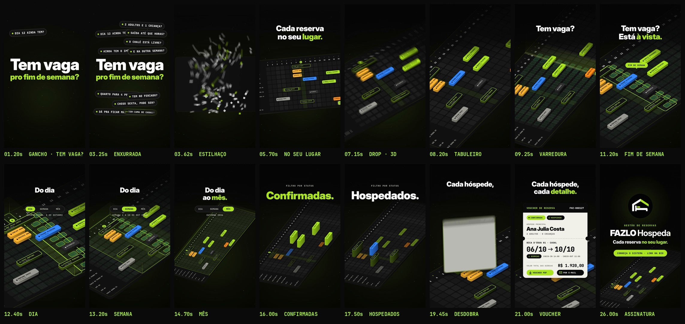

# FAZLO Hospeda — Reel 02 · Gestão de reservas · "Cada reserva no seu lugar."

Peça independente da série, dedicada ao módulo de reservas. Conceito, narrativa, animação e trilha são novos: nada aqui reaproveita a casa/telhado do Reel 00 nem o ciclo do Reel 01 (v2). Os vídeos anteriores continuam intactos.

**Formato:** 9:16 (1080×1920), **27,8 s**, 60 fps, H.264 + AAC 48 kHz, áudio em −14 LUFS.

▶ **Vídeo:** [`output/fazlo-hospeda-reel-02.mp4`](output/fazlo-hospeda-reel-02.mp4)
🖼 **Capa:** [`output/capa.png`](output/capa.png) · Storyboard: [`output/storyboard.jpg`](output/storyboard.jpg) · Revisão: [`output/revisao/`](output/revisao)



---

## Conceito: "Cada reserva no seu lugar."

Toda pousada ouve a mesma pergunta o dia inteiro: **"Tem vaga pro fim de semana?"** A gestão de reservas do FAZLO Hospeda responde com um calendário de ocupação: acomodações de um lado, datas do outro e cada reserva ocupando o seu espaço.

O vídeo transforma esse calendário num **tabuleiro 3D**. As perguntas dos hóspedes se estilhaçam e viram as células do calendário; as reservas se encaixam uma a uma; e, no drop, o calendário se ergue do plano: cada reserva vira um bloco com o comprimento exato das suas diárias. Daí em diante a câmera voa sobre o tabuleiro e mostra, sempre com imagem e não com tela, o que o módulo faz:

| No app (capturas) | No vídeo |
|---|---|
| Calendário de ocupação com status por acomodação (legenda: livre, confirmada, hospedada, check-in, check-out, pré-reserva, bloqueada) | O tabuleiro: 10 acomodações × 31 dias de outubro/2026; cada reserva é um bloco na cor do seu status |
| Diárias livres e "livres no período" | Um feixe de luz varre o tabuleiro e acende as diárias livres; o fim de semana ganha destaque: "Tem vaga? Está à vista." |
| Visões **Dia · Semana · Mês** | Volumes de luz e câmera: quinta, 8 → semana de 4 a 10 → outubro inteiro |
| Filtros **Confirmadas, Hospedados, Pré-reservas, Bloqueios** | O status escolhido sobe como um equalizador; o resto afunda |
| Lista de reservas (código FHZ, hóspede, acomodação, período em diárias) | Os rótulos nos blocos e os encaixes, com os dados de demonstração |
| Detalhe da reserva: hóspede e acompanhantes, datas, check-in 14:00 / check-out 11:00, valor das diárias, **voucher em PDF** e **envio por e-mail** | A reserva FHZ-000127 se levanta do tabuleiro e se desdobra no voucher |

Nada fora disso é prometido: nenhuma automação, integração, canal de venda ou resultado. Nomes, códigos, datas e valores são os **dados de demonstração** das capturas (as 12 reservas da lista, a acomodação em manutenção, o voucher da Ana Julia Costa) e aparecem como ilustração.

## Roteiro (140 BPM em meio-tempo · 1 compasso = 1,714 s)

| Tempo | Compasso | Cena | O que acontece |
|---|---|---|---|
| 0–3,4 s | 1–2 | **Gancho** | **"Tem vaga / pro fim de semana?"** bate no 1º quadro. Perguntas de hóspedes pipocam pela tela cada vez mais rápido (colcheias, depois semicolcheias): "Dia 12 ainda tem?", "Quarto para 4 pessoas?", "Chego sexta, pode ser?"… |
| 3,4–6,9 s | 3–4 | **No seu lugar** | Tudo se estilhaça em 140 quadradinhos que voam e viram as células do calendário. Dias e acomodações se escrevem; as 12 reservas e o bloqueio de manutenção deslizam e travam no lugar, em colcheias e semicolcheias. **"Cada reserva no seu lugar."** |
| 6,9–8,6 s | 5 | **Drop · 3D** | O calendário gira e se inclina; as reservas sobem como blocos, em onda; uma linha de luz atravessa o tabuleiro. |
| 8,6–12,0 s | 6–7 | **Disponibilidade** | O feixe acende as diárias livres de outubro. **"Tem vaga? Está à vista."** O fim de semana se destaca. |
| 12,0–15,4 s | 8–9 | **Dia · Semana · Mês** | Volume de luz sobre quinta, 8; abre para a semana de 4 a 10; a câmera recua até o mês inteiro. **"Do dia ao mês."** |
| 15,4–18,9 s | 10–11 | **Filtros** | **Confirmadas. Pré-reservas. Hospedados. Bloqueios.** A cada dois tempos um status sobe em torres e os demais afundam. |
| 18,9–22,3 s | 12–13 | **Voucher** | A câmera mergulha na reserva FHZ-000127, que se levanta e se desdobra no voucher: hóspede, acompanhantes, Bica D'Água 01, 06/10 → 10/10, 4 diárias, check-in/out, valor, **Voucher PDF** e **Por e-mail**. **"Cada hóspede, cada detalhe."** |
| 22,3–27,8 s | 14–16 | **Assinatura** | O voucher volta ao tabuleiro, a câmera sobe e uma onda limão percorre todas as reservas. A logo entra com a sineta da série: **Gestão de reservas · FAZLO Hospeda · "Cada reserva no seu lugar."** e o convite **"Conheça o sistema · link na bio"**. |

## Direção de arte

- **O tabuleiro:** projeção axonométrica (ortográfica) do plano do calendário, calculada a cada quadro. Os blocos são extrudados de verdade: as laterais saem da envoltória convexa entre a base e o topo, e a ordem de pintura segue a profundidade. Por ser uma transformação afim, o texto dos rótulos é desenhado no próprio plano e inclina junto com ele.
- **Câmera:** o calendário fica plano (legível) na montagem e, no drop, gira cerca de 55° e inclina, virando uma pista diagonal que ocupa o quadro vertical inteiro. Depois a câmera viaja por keyframes (varredura, dia/semana/mês, filtros, mergulho no voucher, subida final).
- **Cores:** preto, verde-limão `#AFFA27` e branco da marca, mais as cores de status do app nos blocos. Diárias livres em verde, destaque do fim de semana em limão.
- **Tipografia:** Inter Display nos títulos, JetBrains Mono nos dados (como no produto).
- **Logo:** o arquivo oficial, sem alteração (`scripts/logo_alpha.py` só torna transparente o branco *fora* do círculo). Desta vez não há nenhum elemento derivado do desenho da logo; ela aparece inteira só na assinatura e na capa.
- **Sem prints, telas, celulares ou computadores.** O voucher é uma peça gráfica (um "ticket"), não a tela do app.
- **Motion blur real** por subamostragem (até 18 amostras por quadro nas passagens rápidas).

## Som

Trilha e efeitos **sintetizados do zero** em Python (numpy/scipy), sem samples, numa linguagem diferente dos Reels anteriores: **140 BPM em meio-tempo, 808 com glide, chimbal com rolos, pizzicato sintético e metais curtos**, Mi menor → Sol maior.

- **Gancho:** só tensão, sem bateria: drone, tique-taque acelerando e pizzicato. Cada pergunta que pipoca toca uma nota da pentatônica, sempre subindo.
- **Estilhaço:** vidro + impacto; 36 cliques em cascata enquanto as células se formam.
- **Encaixes:** cada reserva que trava soa como um bloco de madeira afinado pelo status, com um *whoosh* que vem do lado de onde ela desliza.
- **Drop:** 808 e bumbo, palmas no 3º tempo, metais; a extrusão em onda é uma escala que sobe pelo panorama.
- **Varredura:** um "laser" que atravessa o estéreo da esquerda para a direita; cada diária livre acesa é um *blip* subindo.
- **Filtros:** cada status que sobe é um 808 que desliza para cima.
- **Voucher:** respiro (pad, pizzicato, aro), papel se desdobrando, digitação e o valor rolando.
- **Marca:** a **sineta de recepção da série**, afinada em Si (a terça de Sol maior), o gancho de pizzicato e o acorde final de Sol com 9ª.
- **Sincronia:** a animação exporta `audio/cues.json` (95 eventos) e `audio.py` coloca cada efeito exatamente nesses instantes.
- **Master:** −14 LUFS integrado, com limitador de pico real (sobreamostragem 4×) para chegar ao MP4 abaixo de −1 dBTP mesmo depois do AAC.

## Revisão

`python3 scripts/qa.py` gera [`relatorio-tecnico.txt`](output/revisao/relatorio-tecnico.txt), [`sincronia.txt`](output/revisao/sincronia.txt), [`zonas-seguras.jpg`](output/revisao/zonas-seguras.jpg) e [`capa-no-feed.jpg`](output/revisao/capa-no-feed.jpg).

**Técnica (aprovada):** 1080×1920, 60 fps (1.668 quadros), H.264 High yuv420p, AAC 48 kHz estéreo, 27,800 s de vídeo e de áudio, **−14,0 LUFS**, pico real **−1,7 dBTP** no MP4, sem trechos pretos nem imagem congelada, 1º quadro já com imagem.

**Sincronização (aprovada), em três camadas:**

1. o áudio dentro do MP4 é a trilha, sem deslocamento (0,0 ms no gancho, no drop e na marca);
2. o ataque de 12 golpes-chave, medido no áudio final (estilhaço, drop, fim de semana, troca dia/semana/mês, os 4 filtros, a sineta), cai no instante do evento visual: **desvio médio de 5,0 ms e máximo de 9,3 ms**, menos de 1 quadro (16,7 ms). Os encaixes de reserva (semicolcheias) dividem a grade com o chimbal e a digitação, por isso não entram na medição; a posição deles vem do mesmo `cues.json`;
3. a imagem reage nos 7 golpes principais (pico de movimento entre quadros logo depois do som).

**Visual:** revisão quadro a quadro (com e sem motion blur) durante a produção. Ajustes feitos a partir dela:

- enquadramento 3D refeito: o primeiro ângulo deixava o tabuleiro como uma faixa fina no meio da tela; um estudo de câmeras levou à pista diagonal que ocupa o 9:16;
- blocos "hospedada" (topo preto) ganharam laterais esverdeadas para terem volume sobre o tabuleiro escuro;
- a coluna "hoje" deixou de ser contorno (no 3D virava linhas soltas, parecendo conectores);
- as peças do estilhaço formavam duas listras limão artificiais; agora a cor é sorteada por peça e se funde à célula ao pousar;
- textos fora das áreas cobertas pela interface do Reels (o gancho subiu para não encostar na coluna de ações);
- os títulos só entram depois que a pergunta do gancho sai; a laje do tabuleiro surge junto com as células;
- botões do voucher afastados; etiqueta "fim de semana" ancorada sobre a faixa destacada.

## Arquivos-fonte

```
reels/reel-02/
  src/
    index.html                 # preview (play/scrub com áudio) e página usada no render
    anim.js                    # TODO o motion: câmera axonométrica, tabuleiro, blocos, cenas, capa, cues
    assets/                    # logo oficial + a mesma logo sem o fundo branco externo
    fonts/                     # Inter Display + JetBrains Mono (licença OFL)
  scripts/
    render.cjs                 # cues | video | stills | cover (Chromium headless -> ffmpeg)
    audio.py                   # trilha + efeitos a partir de audio/cues.json, master
    logo_alpha.py              # recorte do fundo da logo (não altera a arte)
    storyboard.py              # storyboard a partir do MP4
    qa.py                      # revisão técnica + sincronização + zonas seguras + capa no feed
  audio/
    cues.json                  # 95 eventos de som exportados da animação
    trilha.wav
  output/
    fazlo-hospeda-reel-02.mp4  # vídeo final
    capa.png                   # capa do Instagram (1080x1920)
    storyboard.jpg
    revisao/
```

A animação é **determinística**: `REEL02.renderAt(ctx, t)` desenha o quadro exato do instante `t`.

### Como renderizar

Requisitos: Node 18+, Playwright (Chromium), ffmpeg, Python 3 com numpy, scipy e Pillow.

```bash
cd reels/reel-02
node scripts/render.cjs cues                   # 1) eventos de som tirados da animação
python3 scripts/audio.py                       # 2) trilha sonora
node scripts/render.cjs video --fps 60         # 3) vídeo final em output/
node scripts/render.cjs cover                  # 4) capa
python3 scripts/storyboard.py                  # 5) storyboard
python3 scripts/qa.py                          # 6) revisão técnica e de sincronização
node scripts/render.cjs stills 8.2,21.0        # (opcional) quadros avulsos em PNG
```

Preview interativo: sirva `reels/reel-02` com qualquer servidor estático e abra `src/index.html` (`?t=12.5` abre num instante; `?cover` mostra a capa).

### Onde editar

- **Tempo e estrutura:** `BPM` e o objeto `T` (seções em compassos), no topo de `src/anim.js`.
- **Dados do tabuleiro:** `ROOMS` (acomodações) e `RES` (reservas: código, hóspede, acomodação, chegada, saída, status).
- **Câmera:** enquadramentos em `CAMS` e a coreografia em `KEYS` (instante, enquadramento, curva). `REEL02.setDebugCam(...)` fixa uma câmera para estudos de enquadramento.
- **Cenas:** perguntas do gancho em `ASKS`, filtros em `FILTERS`, voucher em `drawVoucher`, assinatura em `finale`, capa em `renderCover`.
- **Som:** mudar um tempo em `anim.js` e rodar `render.cjs cues` + `audio.py` já ressincroniza os efeitos. Harmonia e arranjo ficam em `scripts/audio.py` (`CH`, `PROG`, `groove_bar`).
