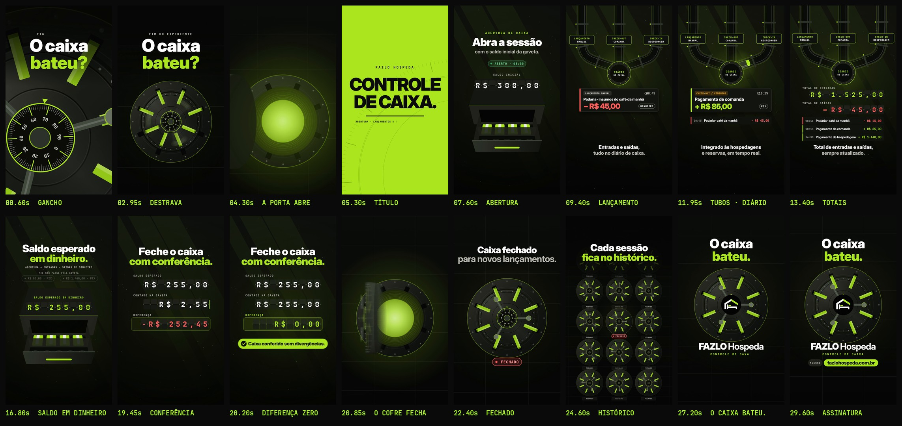

# FAZLO Hospeda — Reel 03 · Controle de Caixa · "O caixa bateu?"

Peça independente da série, dedicada ao módulo de **Caixa**. Conceito, narrativa, animação e trilha são novos: nada aqui reaproveita a casa/telhado do Reel 00, o anel do ciclo do Reel 01 (v2) nem o tabuleiro 3D do Reel 02. Os vídeos anteriores e os Stories continuam intactos.

**Formato:** 9:16 (1080×1920), **30 s**, 60 fps, H.264 + AAC 48 kHz, áudio em −14 LUFS.

▶ **Vídeo:** [`output/fazlo-hospeda-reel-03.mp4`](output/fazlo-hospeda-reel-03.mp4)
🖼 **Capa:** [`output/capa.png`](output/capa.png) · Storyboard: [`output/storyboard.jpg`](output/storyboard.jpg) · Revisão: [`output/revisao/`](output/revisao)



---

## Conceito: "O caixa bateu?"

É a pergunta de todo fim de expediente numa pousada. O vídeo abre com ela e fecha com a resposta: **"O caixa bateu."**

O caixa vira um **cofre-forte em 3D** — peso, precisão e segurança, a importância que o caixa tem na administração da pousada. O segredo gira, as oito travas recolhem, a porta se abre e a luz do cofre toma a tela. Lá dentro, cada etapa real do módulo vira uma peça de mecânica de precisão:

| No app (capturas) | No vídeo |
|---|---|
| **Abertura de sessão**: "Informe o saldo em dinheiro inicial que está na gaveta do caixa"; status **ABERTO**, aberto em 08:00 | A gaveta do caixa desliza para fora; o painel de palhetas marca **SALDO INICIAL R$ 300,00**; selo **ABERTO · 08:00** |
| **Diário de caixa (fluxo)**: cada movimento com descrição, valor, hora, origem (CHECK-IN / DIÁRIAS, CHECK-OUT / CONSUMOS, LANÇAMENTO MANUAL) e forma (Pix, Cartão, Dinheiro) | Três tubos pneumáticos — Lançamento manual, Check-out/Comanda, Check-in/Hospedagem — levam cada movimento em cápsula até o receptor **DIÁRIO DE CAIXA**; cada um sai como um cartão e desce para a lista |
| **Políticas de caixa**: "O livro de caixa é integrado em tempo real com os módulos de Hospedagens e Reservas" | A mensagem "Integrado às hospedagens e reservas, em tempo real." |
| **Total de entradas / Total de saídas** | Painéis de palhetas: **+ R$ 1.525,00** e **− R$ 45,00** |
| **Saldo esperado em dinheiro** (saldo inicial + entradas em dinheiro − saídas em dinheiro) | Os lançamentos em Pix ficam fora da gaveta; a saída em dinheiro entra na conta: **R$ 300,00 → R$ 255,00** |
| **Fechar sessão**: "Confirme o valor em dinheiro físico contado"; resumo com saldo esperado, valor informado, diferença e "**Caixa conferido sem divergências**" | O valor contado é digitado tecla a tecla (0,02 → 0,25 → 2,55 → 25,50 → 255,00) e a diferença é recalculada a cada tecla até **R$ 0,00** |
| "**Caixa fechado para novos lançamentos.**" | A porta do cofre fecha e as travas descem; selo **FECHADO** |
| **Sessões anteriores** (cada uma com abertura, fechamento e diferença) | A câmera recua e mostra uma parede de cofres fechados: **"Cada sessão fica no histórico."** |

Nada fora disso é prometido: nenhuma conciliação bancária, integração externa, automação ou resultado financeiro. Os valores são os **dados de demonstração** das capturas (sessão aberta às 08:00 com R$ 300,00; padaria R$ 45,00 em dinheiro às 08:45; comanda R$ 85,00 em Pix às 10:15; hospedagem R$ 1.440,00 em Pix às 14:30) e aparecem como ilustração. **Nenhum nome de hóspede ou operador** aparece.

## Roteiro (120 BPM · 1 compasso = 2 s)

| Tempo | Compasso | Cena | O que acontece |
|---|---|---|---|
| 0–4 s | 1–2 | **Gancho** | "FIM DO EXPEDIENTE" · **"O caixa / bateu?"** sobre o segredo do cofre em close, que gira em semicolcheias (cada tique é um som). A câmera recua e revela a porta; o volante gira e as **8 travas recolhem**, uma por semicolcheia. A porta se descola com a luz vazando pela fresta. |
| 4–6 s | 3 | **Drop** | A porta gira na dobradiça (com a espessura real do aço) e a câmera mergulha no túnel de luz. A tela fica limão: **CONTROLE / DE CAIXA.** — "Abertura · Lançamentos · Conferência · Fechamento". |
| 6–8 s | 4 | **Abertura** | Persiana metálica. "Abra a sessão com o saldo inicial da gaveta." A gaveta desliza (cédulas e moedas), as palhetas marcam **R$ 300,00** e o selo **ABERTO · 08:00** carimba. |
| 8–14 s | 5–7 | **O fluxo** | Três tubos pneumáticos e o receptor **DIÁRIO DE CAIXA**. Chegam, uma por vez: padaria **− R$ 45,00** (dinheiro, 08:45), comanda **+ R$ 85,00** (Pix, 10:15), hospedagem **+ R$ 1.440,00** (Pix, 14:30). Os cartões descem para a lista e os totais giram: **+ R$ 1.525,00 / − R$ 45,00**. |
| 14–18 s | 8–9 | **Saldo esperado** | "Saldo esperado em dinheiro." Os dois Pix ficam fora da gaveta; a saída em dinheiro cai nela e o painel vai de **R$ 300,00** para **R$ 255,00**. |
| 18–20,4 s | 10 | **Conferência** | "Feche o caixa com conferência." Saldo esperado **R$ 255,00**; o valor contado é digitado e a diferença zera no tempo forte: **R$ 0,00** — "**Caixa conferido sem divergências.**" |
| 20,4–23 s | 11 | **Fechamento** | O painel é engolido pelo cofre; a porta fecha com um estrondo, as travas descem em pares. **"Caixa fechado para novos lançamentos."** |
| 23–26 s | 12–13 | **Histórico** | A câmera recua: uma parede de cofres fechados. **"Cada sessão fica no histórico."** Depois mergulha de volta no cofre da sessão. |
| 26–30 s | 14–15 | **Assinatura** | A logo oficial vira o centro do cofre, com a sineta da série. **"O caixa / bateu."** · **FAZLO Hospeda** · CONTROLE DE CAIXA · **Acesse fazlohospeda.com.br** (um brilho atravessa o domínio). |

## Direção de arte

- **Cofre em perspectiva real:** câmera com posição, guinada, arfagem e rolagem; a porta é um cilindro com espessura que gira em torno da dobradiça, com moldura, túnel iluminado, travas radiais, volante de três raios, segredo numerado (100 marcas) e rebites. Ordem de pintura por profundidade e faces voltadas para a câmera.
- **Painéis de palhetas (split-flap):** todos os valores aparecem como num painel de aeroporto — cada caractere é uma palheta que cai, gira pelos dígitos e assenta; cada palheta tem o seu clique na trilha.
- **Tubos pneumáticos:** vidro com reflexos, abraçadeiras e cápsulas com tampas limão; o receptor pulsa a cada chegada.
- **Transições mecânicas:** persiana de lâminas metálicas, *whip* vertical acompanhando o caminho do dinheiro (dos tubos para a gaveta), o painel da conferência engolido pelo cofre e a câmera contínua do fechamento ao histórico e à assinatura.
- **Cores:** preto, verde-limão `#AFFA27` e branco da marca; aço em tons de oliva; vermelho só para saídas e diferença negativa; cores das etiquetas de origem iguais às do app.
- **Tipografia:** Inter Display nos títulos, JetBrains Mono nos dados.
- **Logo:** o arquivo oficial, sem alteração (`scripts/logo_alpha.py` só torna transparente o branco *fora* do círculo). Ela aparece inteira no centro do cofre, sem nada por cima.
- **Sem prints, telas, celulares ou computadores.** Cartões, gaveta e painéis são peças gráficas.
- **Motion blur real** por subamostragem (12 amostras por quadro nas passagens rápidas).

## Som

Trilha e efeitos **sintetizados do zero** em Python (numpy/scipy), sem samples, numa linguagem nova na série: **trailer híbrido e mecânico, 120 BPM, Ré menor que resolve em Fá maior** exatamente quando a diferença zera.

- **O relógio do cofre é a percussão:** no gancho não há bateria — só drone, um pulso grave de coração, o ostinato de cordas abrindo e os tiques do segredo; o volante é uma catraca; cada trava é um golpe de aço.
- **Drop:** "braam" de metais graves, impacto e a marcha de meio-tempo (bumbo, taiko e caixa no 3º tempo, os tiques do relógio fazendo o chimbal, ostinato em semicolcheias).
- **Palhetas:** cada palheta que cai é um clique — os painéis soam como um painel de aeroporto.
- **Tubos:** sopro com ressonância de cano viajando no estéreo a partir do tubo de origem; a cápsula assenta com um baque oco e escape de ar.
- **Gaveta:** deslize, trava e moedas.
- **Conferência:** a banda recua para teclas e painel, a caixa acelera e, no zero, impacto + arpejo de sinos em Fá maior.
- **Fechamento:** a porta varre o ar, bate com um estrondo metálico e as travas descem em quatro pares.
- **Marca:** a **sineta de recepção da série**, afinada em Lá (a terça de Fá maior), o braam em Fá e o acorde final com arpejo de sinos.
- **Sincronia:** a animação exporta `audio/cues.json` e `audio.py` coloca cada efeito exatamente nesses instantes (cada tique, trava, palheta, cápsula, tecla).
- **Master:** −14 LUFS integrado, com limitador de pico real (sobreamostragem 4×) para chegar ao MP4 abaixo de −1 dBTP mesmo depois do AAC.

## Revisão

`python3 scripts/qa.py` gera [`relatorio-tecnico.txt`](output/revisao/relatorio-tecnico.txt), [`sincronia.txt`](output/revisao/sincronia.txt), [`zonas-seguras.jpg`](output/revisao/zonas-seguras.jpg) e [`capa-no-feed.jpg`](output/revisao/capa-no-feed.jpg).

**Técnica (aprovada):** 1080×1920, 60 fps (1.800 quadros), H.264 High yuv420p, AAC 48 kHz estéreo, 30,000 s de vídeo e de áudio, **−14,0 LUFS**, pico real **−2,2 dBTP** no MP4, sem trechos pretos nem imagem congelada, 1º quadro já com imagem.

**Sincronização (aprovada), em três camadas:**

1. o áudio dentro do MP4 é a trilha, sem deslocamento (0,0 ms no gancho, no drop e na assinatura);
2. o ataque de 25 golpes-chave, medido no áudio final (as 8 travas que destravam, o drop, a gaveta, as 3 cápsulas que chegam, as 5 teclas da contagem, a diferença zero, o estrondo da porta, as 4 travas que descem e a logo), cai no instante do evento visual: **desvio médio de 5,1 ms e máximo de 6,8 ms**, menos de meio quadro (16,7 ms). Os cliques das palhetas e os tiques do segredo dividem a grade com a percussão, por isso não entram na medição; a posição deles vem do mesmo `cues.json`;
3. a imagem reage nos 7 golpes principais (pico de movimento entre quadros logo depois do som).

**Visual e áreas seguras:** revisão quadro a quadro (com e sem motion blur) durante a produção; nenhum texto nas áreas cobertas pela interface do Reels (topo, legenda embaixo e coluna de ações à direita). Ajustes feitos a partir dela:

- a pergunta do gancho ganhou um véu escuro no topo para ler sobre o metal do cofre em close;
- o painel de palhetas da gaveta ficava por cima do gabinete; a gaveta desceu e o painel ficou acima dela;
- no fim do fluxo, a lista do diário encostava no texto; cartões, lista e totais foram reorganizados;
- a diferença da conferência mostrava palhetas vazias girando ("88R$70,00"); agora ela é recalculada a cada tecla (−R$ 255,00 → −R$ 254,98 → … → R$ 0,00) e cada valor assenta em cerca de 0,15 s;
- na assinatura, os cofres vizinhos invadiam o texto; agora eles somem no mergulho e a logo chega depois que a câmera para;
- as persianas fechavam em preto puro (0,2 s de tela preta); agora são lâminas de aço com fio limão;
- o saldo esperado ficava parado quase 1 s; ganhou aproximação lenta e pulso de luz no tempo;
- o selo FECHADO e o ponto de "DE CAIXA." saíram das faixas da legenda e da coluna de ações;
- o Reel passou de 28 para 30 s para que "Caixa fechado para novos lançamentos" e "Cada sessão fica no histórico" tenham tempo de leitura.

**Som:** a catraca do volante deixou de pisar nas travas; o estrondo da porta ganhou corpo curto para as travas seguintes aparecerem; a mixagem perdeu o excesso de agudos perto de Nyquist, que fazia o AAC estourar o pico (−0,4 → −2,2 dBTP).

## Arquivos-fonte

```
reels/reel-03/
  src/
    index.html                 # preview (play/scrub com áudio) e página usada no render
    anim.js                    # TODO o motion: câmera 3D, cofre, gaveta, palhetas, tubos, cenas, capa, cues
    assets/                    # logo oficial + a mesma logo sem o fundo branco externo
    fonts/                     # Inter Display + JetBrains Mono (licença OFL)
  scripts/
    render.cjs                 # cues | video | stills | cover (Chromium headless -> ffmpeg)
    audio.py                   # trilha + efeitos a partir de audio/cues.json, master
    logo_alpha.py              # recorte do fundo da logo (não altera a arte)
    storyboard.py              # storyboard a partir do MP4
    qa.py                      # revisão técnica + sincronização + zonas seguras + capa no feed
  audio/
    cues.json                  # eventos de som exportados da animação
    trilha.wav
  output/
    fazlo-hospeda-reel-03.mp4  # vídeo final
    capa.png                   # capa do Instagram (1080x1920)
    storyboard.jpg
    revisao/
```

A animação é **determinística**: `REEL03.renderAt(ctx, t)` desenha o quadro exato do instante `t`.

### Como renderizar

Requisitos: Node 18+, Playwright (Chromium), ffmpeg, Python 3 com numpy, scipy e Pillow.

```bash
cd reels/reel-03
node scripts/render.cjs cues                   # 1) eventos de som tirados da animação
python3 scripts/audio.py                       # 2) trilha sonora
node scripts/render.cjs video --fps 60         # 3) vídeo final em output/
node scripts/render.cjs cover                  # 4) capa
python3 scripts/storyboard.py                  # 5) storyboard
python3 scripts/qa.py                          # 6) revisão técnica e de sincronização
node scripts/render.cjs stills 4.2,19.9        # (opcional) quadros avulsos em PNG
```

Preview interativo: sirva `reels/reel-03` com qualquer servidor estático e abra `src/index.html` (`?t=12.5` abre num instante; `?cover` mostra a capa).

### Onde editar

- **Tempo e estrutura:** `BPM`, `DURATION` e o objeto `T` (início de cada cena), no topo de `src/anim.js`.
- **O cofre:** dimensões em `VR`, `VT`, `FR0`, `FR1`; estado ao longo do filme em `vaultState`; câmeras em `CAM_OPEN` e `CAM_CLOSE`.
- **Dados:** movimentos da sessão em `ENTRIES` (hora, origem, descrição, valor, forma) e os painéis em `TRK_*` (cada chave é um valor que o painel assume num instante).
- **Som:** mudar um tempo em `anim.js` e rodar `render.cjs cues` + `audio.py` já ressincroniza os efeitos. Harmonia e arranjo ficam em `scripts/audio.py` (`CH`, `PROG`, `groove`).
