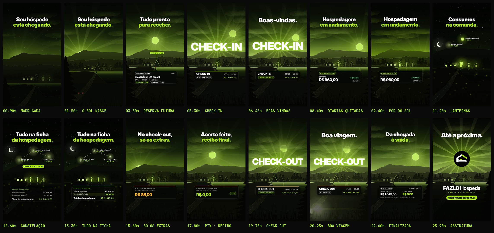

# FAZLO Hospeda — Reel 05 · Check-in & Check-out · "Da chegada à saída."

Peça independente da série, dedicada ao módulo de **Hospedagens**: reservas futuras, check-in, hospedagens em andamento, consumos na comanda, pagamentos, check-out e recibo final. Conceito, narrativa, animação e trilha são novos: nada aqui reaproveita a casa/telhado do Reel 00, o anel do ciclo do Reel 01 (v2), o tabuleiro 3D do Reel 02 nem o cofre do Reel 03. Os vídeos anteriores e os Stories continuam intactos. (Não existe Reel 04 neste repositório; a numeração segue a do pedido.)

**Formato:** 9:16 (1080×1920), **28,8 s**, 60 fps, H.264 + AAC 48 kHz, áudio em −14 LUFS.

▶ **Vídeo:** [`output/fazlo-hospeda-reel-05.mp4`](output/fazlo-hospeda-reel-05.mp4)
🖼 **Capa:** [`output/capa.png`](output/capa.png) · Storyboard: [`output/storyboard.jpg`](output/storyboard.jpg) · Revisão: [`output/revisao/`](output/revisao)



---

## Conceito: "Da chegada à saída."

Uma hospedagem é um dia inteiro na pousada — e o vídeo é esse dia, em **time-lapse**. A paisagem é construída em camadas com paralaxe (serras, colinas com pinheiros, os chalés, o lago, a estrada e o mato em primeiro plano) e o céu atravessa madrugada, nascer do sol, meio-dia, pôr do sol, noite estrelada e a manhã seguinte, sempre em preto e limão.

Os momentos da hospedagem viram fenômenos dessa paisagem:

- o carro do hóspede chega pela estrada ao amanhecer;
- **CHECK-IN nasce atrás da serra como um sol**, a luz do chalé acende;
- à noite, cada consumo sobe do chalé como uma **lanterna** e vira estrela; as estrelas se ligam e formam a **constelação da comanda** (R$ 85,00), que desce para a ficha da hospedagem;
- de manhã, o acerto: só os extras, em Pix, e o recibo final;
- **CHECK-OUT se põe atrás da serra** enquanto o carro parte, com o clarão dos faróis passando pela câmera;
- no fim, **a logo nasce como o sol** sobre o vale.

Os dados aparecem em cartões de vidro sobre a paisagem — nenhuma tela, celular ou computador.

| No app (capturas) | No vídeo |
|---|---|
| Abas **Futuras · Hospedados ativos · Finalizadas** | Os três estados do cartão: **RESERVA FUTURA → HOSPEDADO ATIVO → FINALIZADO** (o chip vira no check-in e no check-out) |
| **Detalhes da reserva:** datas das diárias, origem/canal **Site**, "Check-in regular: 14:00 · Check-out regular: 11:00" | Cartão da reserva futura: **Bica D'Água 02 · Casal**, 07/10 → 09/10 · 2 diárias, **SITE**, CHECK-IN 14:00 / CHECK-OUT 11:00 — "Tudo pronto para receber." |
| Check-in liberado a partir da data de entrada | No dia da chegada, **CHECK-IN** nasce e o status vira **HOSPEDADO ATIVO** (07/10 · 14:00) |
| Pagamento das diárias: **R$ 960,00**, 07/10 via **CARTÃO**; Diárias — **Status: QUITADA** | "Hospedagem em andamento." Cartão **DIÁRIAS R$ 960,00 · QUITADA · CARTÃO** |
| **Comanda** — "Produtos e serviços extras" **R$ 85,00** | As lanternas/estrelas da noite somam **COMANDA · R$ 85,00** (os itens são ilustrativos; o total é o da captura) |
| **Resumo financeiro:** Diárias R$ 960,00 (quitada), Comanda R$ 85,00, **Total da hospedagem R$ 1.045,00** | "Tudo na ficha da hospedagem." Cartão **RESUMO FINANCEIRO** com as três linhas; a comanda pousa na sua linha |
| **A receber no Check-out (somente consumos/extras)**; pagamento de comanda **CHECK-OUT / CONSUMOS**, 09/10 via **PIX** | "No check-out, só os extras." **R$ 85,00 → Pix → R$ 0,00** |
| Botão **Recibo Final / Check-out** | "Acerto feito, recibo final." Chip **RECIBO FINAL** |
| Card finalizado: **TOTAL DA ESTADIA R$ 1.045,00 · SALDO FINAL R$ 0,00 · 07/10 → 09/10 · Saída contratada 09/10 · Registrada às 10:15** | CHECK-OUT 09/10 · 10:15, status **FINALIZADO**; cartão da estadia finalizada com os mesmos valores — "Da chegada à saída." |

Nada fora disso é prometido: nenhuma automação, integração, chave de porta, mensagem ao hóspede ou cobrança automática. Os valores são os **dados de demonstração** das capturas. **Nenhum nome de hóspede ou operador** aparece.

## Roteiro (100 BPM · 1 compasso = 2,4 s)

| Tempo | Compasso | Cena | O que acontece |
|---|---|---|---|
| 0–2,4 s | 1 | **Gancho** | Madrugada: estrelas, vaga-lumes, as janelas acesas da pousada. **"Seu hóspede / está chegando."** O sol rompe a serra num leque de raios (1,2 s) enquanto a câmera desce do céu e revela o vale; o carro entra pela estrada, lanternas vermelhas acesas. |
| 2,4–4,8 s | 2 | **Reserva futura** | **"Tudo pronto / para receber."** Etiqueta **BICA D'ÁGUA 02** aponta o chalé; cartão da reserva (Site, 07/10 → 09/10, 2 diárias, check-in 14:00, check-out 11:00). O carro chega ao portão. |
| 4,8–7,2 s | 3 | **Check-in** | **CHECK-IN** nasce atrás da serra como um sol, com a sineta da recepção. A luz do chalé acende; o chip vira **RESERVA FUTURA → HOSPEDADO ATIVO**. **"Boas-vindas."** |
| 7,2–9,6 s | 4 | **Em andamento** | **"Hospedagem / em andamento."** Diárias **R$ 960,00 · QUITADA · CARTÃO**. O dia acelera: nuvens em time-lapse, o sol desce e a tarde vira pôr do sol. |
| 9,6–12 s | 5 | **Consumos** | Noite. **"Consumos / na comanda."** Três lanternas sobem do chalé e viram estrelas no tempo forte de cada batida; as estrelas se ligam numa constelação. |
| 12–14,4 s | 6 | **A ficha** | **COMANDA · R$ 85,00** surge, uma estrela cadente cruza o céu e a comanda desce para o cartão **RESUMO FINANCEIRO** (Diárias 960 · Comanda 85 · **Total R$ 1.045,00**). **"Tudo na ficha / da hospedagem."** |
| 14,4–16,8 s | 7 | **Manhã** | O sol nasce de novo, pássaros cruzam o céu. **"No check-out, / só os extras."** A receber: **R$ 85,00** (somente consumos e extras). |
| 16,8–19,2 s | 8 | **Acerto** | **"Acerto feito, / recibo final."** Pix ✓ — o valor rola para **R$ 0,00** — e o chip **RECIBO FINAL**. |
| 19,2–21,6 s | 9 | **Check-out** | **CHECK-OUT** aparece sobre a serra; a luz do chalé apaga, o chip vira **FINALIZADO** (09/10 · 10:15, saldo final R$ 0,00). O carro parte de frente, os faróis passam pela câmera num clarão anamórfico e a palavra se põe atrás da serra. **"Boa viagem."** |
| 21,6–24 s | 10 | **Finalizada** | **"Da chegada / à saída."** Estadia finalizada: **R$ 1.045,00 · saldo final R$ 0,00 · saída contratada 09/10 · registrada às 10:15**. Fim de tarde dourado; o sol se põe. |
| 24–28,8 s | 11–12 | **Assinatura** | A **logo oficial nasce como o sol** sobre o vale, com a sineta da série. **"Até a próxima."** · **FAZLO Hospeda** · CHECK-IN & CHECK-OUT · **fazlohospeda.com.br** (um brilho atravessa o domínio). |

## Direção de arte

- **Paisagem em camadas com paralaxe:** duas serras com luz de borda, colinas com pinheiros, a pousada (recepção e três chalés em A, o do hóspede destacado), lago que espelha o céu (reflexos do sol, da lua e das janelas), estrada em perspectiva, mato e pinheiros recortados em primeiro plano. A câmera faz um *pan* contínuo do começo ao fim, desce do céu na abertura, aproxima-se do chalé à noite e dá pequenos impulsos nos tempos fortes.
- **Time-lapse do céu:** seis paletas (madrugada, aurora, manhã, meio-dia, pôr do sol, dourado) e a noite, interpoladas; sol e lua com trajetórias próprias, estrelas que cintilam e somem de dia, nuvens que aceleram nas passagens de tempo, vaga-lumes, pássaros e uma estrela cadente.
- **Palavras gigantes entre as serras:** CHECK-IN e CHECK-OUT são desenhadas *atrás* da serra mais próxima — nascem e se põem de verdade, com raios próprios.
- **Cartões de vidro** com faixa de status: limão (estadia), âmbar (check-out, cor do app para valores a receber) e cinza (finalizada); chips que viram como uma ficha.
- **Cores:** preto, verde-limão `#AFFA27` e branco da marca; âmbar e verde de "quitada" iguais aos do app; vermelho só nas lanternas traseiras do carro.
- **Tipografia:** Inter Display nos títulos, JetBrains Mono nos dados.
- **Logo:** o arquivo oficial, sem alteração (`scripts/logo_alpha.py` só torna transparente o branco *fora* do círculo). Ela nasce inteira sobre a serra, sem nada por cima.
- **Sem prints, telas, celulares ou computadores.**
- **Motion blur real** por subamostragem (10 amostras por quadro nas passagens rápidas).

## Som

Trilha e efeitos **sintetizados do zero** em Python (numpy/scipy), sem samples, numa linguagem nova na série: **house orgânico a 100 BPM em Sol maior** (G · D/F# · Em · C), com violão de nylon (Karplus-Strong), kalimbas, congas, chocalho e baixo de contratempo.

- **Madrugada:** grilos, um acorde suspenso e o "bloom" de sinos quando o sol nasce, com os primeiros pássaros.
- **Chegada:** o violão entra com o carro (motor e rodagem se afastando no estéreo) e o groove abre no **CHECK-IN**, quando o hóspede toca a **sineta da recepção**.
- **Noite:** a banda recua para kalimbas e grilos; cada lanterna sobe com uma nota e cada estrela acende com um sininho, no tempo forte da batida; a constelação fecha com um arpejo e a comanda pousa na ficha.
- **Manhã:** pássaros, o groove volta; **Pix** com toque de duas notas, o valor rolando até zero e o recibo saindo.
- **Check-out:** dois toques descendo ("até logo"), a luz do chalé apaga, o carro vem até a câmera e passa com o clarão; a palavra se põe num glissando descendente.
- **Marca:** a **sineta de recepção da série**, afinada em Si (a terça de Sol maior), sobre o acorde final em Sol (add9) e um arpejo de sininhos.
- **Sincronia:** a animação exporta `audio/cues.json` e `audio.py` coloca cada efeito exatamente nesses instantes.
- **Master:** −14 LUFS integrado, com limitador de pico real (sobreamostragem 4×) para chegar ao MP4 abaixo de −1 dBTP mesmo depois do AAC.

## Revisão

`python3 scripts/qa.py` gera [`relatorio-tecnico.txt`](output/revisao/relatorio-tecnico.txt), [`sincronia.txt`](output/revisao/sincronia.txt), [`zonas-seguras.jpg`](output/revisao/zonas-seguras.jpg) e [`capa-no-feed.jpg`](output/revisao/capa-no-feed.jpg).

_Resultados da revisão: em produção (o vídeo final está sendo renderizado)._

## Arquivos-fonte

```
reels/reel-05/
  src/
    index.html                 # preview (play/scrub com áudio) e página usada no render
    anim.js                    # TODO o motion: céu, paisagem, câmera, cartões, lanternas, cenas, capa, cues
    assets/                    # logo oficial + a mesma logo sem o fundo branco externo
    fonts/                     # Inter Display + JetBrains Mono (licença OFL)
  scripts/
    render.cjs                 # cues | video | stills | cover (Chromium headless -> ffmpeg)
    audio.py                   # trilha + efeitos a partir de audio/cues.json, master
    logo_alpha.py              # recorte do fundo da logo (não altera a arte)
    storyboard.py              # storyboard a partir do MP4
    qa.py                      # revisão técnica + sincronização + zonas seguras + capa no feed
  audio/
    cues.json                  # eventos de som exportados da animação
    trilha.wav
  output/
    fazlo-hospeda-reel-05.mp4  # vídeo final
    capa.png                   # capa do Instagram (1080x1920)
    storyboard.jpg
    revisao/
```

A animação é **determinística**: `REEL05.renderAt(ctx, t)` desenha o quadro exato do instante `t`.

### Como renderizar

Requisitos: Node 18+, Playwright (Chromium), ffmpeg, Python 3 com numpy, scipy e Pillow.

```bash
cd reels/reel-05
node scripts/render.cjs cues                   # 1) eventos de som tirados da animação
python3 scripts/audio.py                       # 2) trilha sonora
node scripts/render.cjs video --fps 60         # 3) vídeo final em output/
node scripts/render.cjs cover                  # 4) capa
python3 scripts/storyboard.py                  # 5) storyboard
python3 scripts/qa.py                          # 6) revisão técnica e de sincronização
node scripts/render.cjs stills 5.2,12.9        # (opcional) quadros avulsos em PNG
```

Preview interativo: sirva `reels/reel-05` com qualquer servidor estático e abra `src/index.html` (`?t=12.5` abre num instante; `?cover` mostra a capa).

### Onde editar

- **Tempo e estrutura:** `BPM`, `DURATION` e o objeto `T` (início de cada cena), no topo de `src/anim.js`.
- **O dia:** paletas em `SKY`, a sequência do time-lapse em `SKY_KEYS`, trajetórias em `SUN` e `MOON`; câmera em `CAMX`, `CAMY` e `zoomAt`.
- **Paisagem:** serras em `RIDGES`, chalés em `HOUSES`, estrada em `buildRoad`.
- **Dados:** cartões em `cards()`; itens da comanda em `ITEMS`.
- **Som:** mudar um tempo em `anim.js` e rodar `render.cjs cues` + `audio.py` já ressincroniza os efeitos. Harmonia e arranjo ficam em `scripts/audio.py` (`CH`, `PROG`, `groove`).
