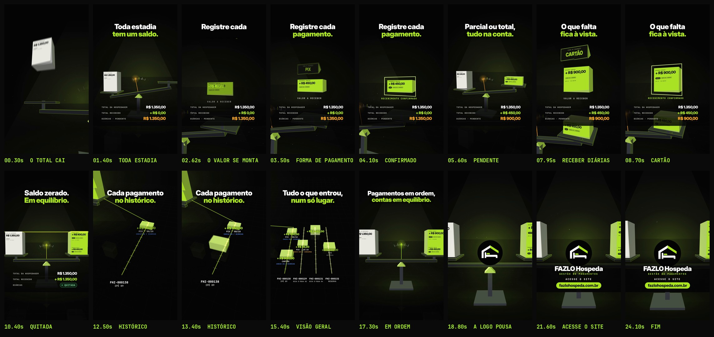

# FAZLO Hospeda — Reel 06 · Gestão de Pagamentos · "Em equilíbrio."

Peça independente da série, dedicada aos **pagamentos** de reservas e hospedagens: registrar um pagamento (valor e forma), acompanhar o que já foi recebido e o que está pendente, consultar o histórico e ter a visão geral do que entrou. Conceito, narrativa, animação e trilha são novos: nada aqui reaproveita a casa/telhado do Reel 00, o anel do ciclo do Reel 01 (v2), o tabuleiro 3D do Reel 02, o cofre do Reel 03 (Controle de Caixa) nem a paisagem do Reel 05. Os vídeos anteriores e os Stories continuam intactos.

**Formato:** 9:16 (1080×1920), **24,25 s**, 60 fps, H.264 + AAC 48 kHz, áudio em −14 LUFS.

▶ **Vídeo:** [`output/fazlo-hospeda-reel-06.mp4`](output/fazlo-hospeda-reel-06.mp4)
🖼 **Capa:** [`output/capa.png`](output/capa.png) · Storyboard: [`output/storyboard.jpg`](output/storyboard.jpg) · Revisão: [`output/revisao/`](output/revisao)



---

## Conceito: "Em equilíbrio."

Toda estadia tem um saldo, e gerir pagamentos é saber, a cada momento, quanto já entrou e quanto falta. O Reel transforma isso numa **balança de precisão monumental, em 3D**:

- de um lado pousa o **total da hospedagem**;
- do outro, cada **pagamento registrado** ganha corpo: o valor se monta dígito a dígito, um **prisma escolhe a forma de pagamento** (PIX · CARTÃO · DINHEIRO), o **recebimento é confirmado** e o bloco cai no prato;
- o **ponteiro** mostra o que ainda está pendente, até a balança ficar **nivelada: quitada**;
- a **linha de nível** vira o **histórico de pagamentos**; o histórico se multiplica na **visão geral** (uma trilha por reserva/hospedagem);
- no fim, a **logo pousa no centro da balança**, em equilíbrio.

Organização (cada valor no seu lugar), confiança (a conta fecha), precisão (o ponteiro, as réguas) e clareza (o pendente à vista).

| No app (capturas) | No vídeo |
|---|---|
| **Receber pagamento:** saldo pendente, **valor a receber** (pode ser parcial), **meio de pagamento** (PIX no seletor) e **Confirmar recebimento** | O valor se monta e vira um bloco ("VALOR A RECEBER"); o prisma gira e para na forma escolhida; "RECEBIMENTO CONFIRMADO" e o bloco é liberado |
| **Histórico de pagamentos:** "Pagamento parcial de hospedagem", **CHECK-IN / DIÁRIAS**, Ipê 09 · FHZ-000138, 08/10 via **PIX**, **+ R$ 450,00** | 1º bloco: **+ R$ 450,00 · PIX · CHECK-IN / DIÁRIAS** — "Parcial ou total, tudo na conta." |
| **Resumo financeiro:** Diárias **R$ 1.350,00** · Status **PENDENTE** · *Pendente: R$ 900,00*; **Total recebido + R$ 450,00** | O total pousa no prato da esquerda; o resumo na base mostra TOTAL DA HOSPEDAGEM, TOTAL RECEBIDO e **DIÁRIAS · PENDENTE R$ 900,00** |
| Botão **Receber diárias — R$ 900,00** | 2º bloco: **+ R$ 900,00 · CARTÃO · RECEBER DIÁRIAS**; a balança nivela, o pendente vira **QUITADA** |
| **Visão geral:** cada pagamento com valor, acomodação, código da reserva/hospedagem, data/hora, origem (**CHECK-OUT / CONSUMOS**…) e forma (Pix): *Pagamento de comanda + R$ 85,00 · Bica D'Água 02 · FHZ-000129 · 10:15*; *Pagamento de hospedagem + R$ 1.440,00 · Bica D'Água 04 · FHZ-000131* | Trilhas de luz no chão, uma por reserva/hospedagem (FHZ-000138, FHZ-000129, FHZ-000131, FHZ-000132), com cada pagamento, a forma, a origem e a hora — "Tudo o que entrou, num só lugar." |
| **Detalhes da reserva FHZ-000132:** saldo pendente **R$ 930,00**, recebimento em **PIX** | A trilha da reserva FHZ-000132 com **+ R$ 930,00 · PIX** (pagamentos de reservas e de hospedagens) |

Nada fora disso é prometido: **nenhum processamento automático de Pix, cobrança integrada ou conciliação bancária**. O recebimento é registrado e confirmado no sistema, como nas capturas. A forma do 2º pagamento (cartão) e a ordem dos blocos são ilustrativas; os valores, códigos, acomodações, datas e horários são os **dados de demonstração** das capturas. **Nenhum nome de hóspede ou operador** aparece.

## Roteiro (104 BPM · 1 compasso = 2,31 s)

| Tempo | Compasso | Cena | O que acontece |
|---|---|---|---|
| 0–2,3 s | 1 | **Gancho** | De baixo, o bloco branco **TOTAL DA HOSPEDAGEM · R$ 1.350,00** despenca no prato; a balança tomba, o ponteiro varre o mostrador até o pendente. **"Toda estadia / tem um saldo."** O resumo aparece na base. |
| 2,3–4,6 s | 2 | **Registrar** | **"Registre cada / pagamento."** Os dígitos voam e montam **+ R$ 450,00**; a placa ganha corpo; o prisma gira e para em **PIX**; o selo contorna o bloco: **RECEBIMENTO CONFIRMADO**. |
| 4,6–6,9 s | 3 | **Parcial** | O bloco pousa no tempo forte; o braço sobe só um pouco. **"Parcial ou total, / tudo na conta."** Resumo: recebido **+ R$ 450,00**, **DIÁRIAS · PENDENTE R$ 900,00**. |
| 6,9–9,2 s | 4 | **Receber diárias** | **"O que falta / fica à vista."** O 2º valor se monta (**+ R$ 900,00**), o prisma para em **CARTÃO**, confirmação. |
| 9,2–11,5 s | 5 | **Equilíbrio** | O bloco pousa, a balança nivela, o ponteiro crava no zero e uma **linha de nível** atravessa a tela. **"Saldo zerado. / Em equilíbrio."** O pendente vira **QUITADA**. |
| 11,5–13,8 s | 6 | **Histórico** | A câmera desce para o chão: a trilha da FHZ-000138 recebe cópias dos dois pagamentos (**+ R$ 450,00 · PIX · 08/10**; **+ R$ 900,00 · CARTÃO**). **"Cada pagamento / no histórico."** |
| 13,8–16,2 s | 7 | **Visão geral** | De cima, mais três trilhas acendem: **FHZ-000129** (+ R$ 85,00 · PIX · 10:15 · CHECK-OUT / CONSUMOS), **FHZ-000131** (+ R$ 1.440,00 · HOSPEDAGEM) e **FHZ-000132** (+ R$ 930,00 · PIX · RESERVA). **"Tudo o que entrou, / num só lugar."** |
| 16,2–18,5 s | 8 | **Em ordem** | De volta à balança nivelada. **"Pagamentos em ordem, / contas em equilíbrio."** |
| 18,5–24,25 s | 9–11 | **Assinatura** | A **logo oficial** desce e pousa no centro da balança, que não se move (a carga no centro não desequilibra), com a sineta da série. **FAZLO Hospeda** · GESTÃO DE PAGAMENTOS · **ACESSE O SITE** · **fazlohospeda.com.br** (um brilho atravessa o endereço). |

## Direção de arte

- **3D de verdade em Canvas 2D:** câmera em perspectiva com posição e alvo; balança de Roberval (o braço gira no fulcro limão e os pratos ficam sempre na horizontal); blocos com volume e iluminação por face (luz-chave, contraluz limão); **chão espelhado**, refletor volumétrico, poeira na luz.
- **Física de mola:** cada pouso dá um impulso ao braço, que oscila e assenta; o ponteiro acompanha e muda de âmbar (pendente) para limão (nivelado).
- **Proporção real:** a altura de cada bloco é proporcional ao valor — 450 + 900 empilham exatamente a altura de 1.350.
- **Cores:** preto, verde-limão `#AFFA27` e branco da marca; âmbar para o pendente e verde para "QUITADA" (as cores de status do app); azul e laranja nas etiquetas de origem, como no app.
- **Tipografia:** Inter Display nos títulos e valores, JetBrains Mono nos rótulos e no resumo.
- **Logo:** o arquivo oficial, sem alteração (só o branco *fora* do círculo é transparente, `scripts/logo_alpha.py`). Ela desce e pousa inteira, sem rotação nem deformação.
- **Sem prints, telas, celulares ou computadores.**
- **Motion blur real** por subamostragem (10–12 amostras nas passagens rápidas).

## Som

Trilha e efeitos **sintetizados do zero** em Python (numpy/scipy), sem samples, numa linguagem nova na série: **pulso de precisão a 104 BPM, Dó menor que resolve em Mi bemol maior** no instante em que a balança nivela.

- **O mecanismo:** um ostinato de pluck FM em semicolcheias, piano abafado, baixo em contratempo e bateria seca.
- **A balança é a percussão dos efeitos:** o total desabando (impacto + metal), o braço balançando com os tiques do ponteiro varrendo o mostrador, os dígitos que se juntam, a placa que ganha corpo, o prisma girando como uma catraca até parar, o "clique" da forma escolhida, a confirmação em duas notas e o peso de cada bloco pousando.
- **Equilíbrio:** a harmonia sai do menor para Mi bemol maior, com prato, sinos e a linha de nível atravessando o estéreo.
- **Histórico e visão geral:** cada registro que pousa na trilha toca uma nota do acorde.
- **Marca:** a **sineta de recepção da série**, afinada em Sol (a terça de Mi bemol maior), sobre o acorde final com 9ª.
- **Sincronia:** a animação exporta `audio/cues.json` e `audio.py` coloca cada efeito exatamente nesses instantes.
- **Master:** −14 LUFS integrado, limitador de pico real (sobreamostragem 4×), passa-baixa em 15,5 kHz para o AAC não estourar o pico.

## Revisão

`python3 scripts/qa.py` gera [`relatorio-tecnico.txt`](output/revisao/relatorio-tecnico.txt), [`sincronia.txt`](output/revisao/sincronia.txt), [`zonas-seguras.jpg`](output/revisao/zonas-seguras.jpg) e [`capa-no-feed.jpg`](output/revisao/capa-no-feed.jpg).

_Resultados da revisão: em produção (o vídeo final está sendo renderizado)._

## Arquivos-fonte

```
reels/reel-06/
  src/
    index.html                 # preview (play/scrub com áudio) e página usada no render
    anim.js                    # TODO o motion: câmera 3D, balança, blocos, prisma, trilhas, textos, capa, cues
    assets/                    # logo oficial + a mesma logo sem o fundo branco externo
    fonts/                     # Inter Display + JetBrains Mono (licença OFL)
  scripts/
    render.cjs                 # cues | video | stills | cover (Chromium headless -> ffmpeg)
    audio.py                   # trilha + efeitos a partir de audio/cues.json, master
    logo_alpha.py              # recorte do fundo da logo (não altera a arte)
    storyboard.py              # storyboard a partir do MP4
    qa.py                      # revisão técnica + sincronização + zonas seguras + capa no feed
  audio/
    cues.json                  # eventos de som exportados da animação
    trilha.wav
  output/
    fazlo-hospeda-reel-06.mp4  # vídeo final
    capa.png                   # capa do Instagram (1080x1920)
    storyboard.jpg
    revisao/
```

A animação é **determinística**: `REEL06.renderAt(ctx, t)` desenha o quadro exato do instante `t`.

### Como renderizar

Requisitos: Node 18+, Playwright (Chromium), ffmpeg, Python 3 com numpy, scipy e Pillow.

```bash
cd reels/reel-06
node scripts/render.cjs cues                   # 1) eventos de som tirados da animação
python3 scripts/audio.py                       # 2) trilha sonora
node scripts/render.cjs video --fps 60         # 3) vídeo final em output/
node scripts/render.cjs cover                  # 4) capa
python3 scripts/storyboard.py                  # 5) storyboard
python3 scripts/qa.py                          # 6) revisão técnica e de sincronização
node scripts/render.cjs stills 4.6,9.4         # (opcional) quadros avulsos em PNG
```

Preview interativo: sirva `reels/reel-06` com qualquer servidor estático e abra `src/index.html` (`?t=9.4` abre num instante; `?cover` mostra a capa).

### Onde editar

- **Tempo e estrutura:** `BPM`, `DURATION` e o objeto `T`, no topo de `src/anim.js`.
- **A balança:** `PIV`, `ARM`, `POST`, `PLAT`; altura dos blocos em `HV`; inclinação máxima `THMAX`; a física em `theta()` (uma mola por pouso).
- **Dados:** os pagamentos em `PAY` (valor, forma, origem) e as trilhas da visão geral em `LANES`.
- **Câmera:** chaves em `buildCamera()` (posição e ponto olhado).
- **Som:** mudar um tempo em `anim.js` e rodar `render.cjs cues` + `audio.py` já ressincroniza os efeitos. Harmonia e arranjo ficam em `scripts/audio.py` (`CH`, `PROG`, `groove`, `arp`).
