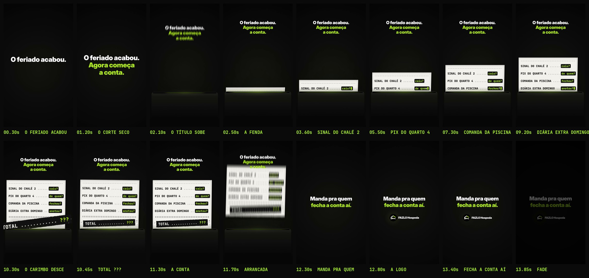

# FAZLO Hospeda — Reel 07 · Pilar ROTINA · "O feriado acabou. Agora começa a conta."

Primeiro vídeo do pilar editorial **ROTINA**. O objetivo não é apresentar funcionalidades nem vender o sistema: é fazer o proprietário ou gestor de pousada **se reconhecer** na conferência do pós-feriado e mandar o vídeo, por DM, para quem fecha a conta com ele. Publicação prevista: terça-feira, 13/10/2026, depois do feriado prolongado de 12/10.

Peça independente: nada aqui altera os Reels anteriores nem os Stories.

**Formato:** 9:16 (1080×1920), **14,0 s**, 60 fps, H.264 + AAC 48 kHz. **Só efeitos sonoros**, sem trilha musical: a música pode ser escolhida na biblioteca do Instagram na publicação, e o vídeo funciona sem ela.

▶ **Vídeo:** [`output/fazlo-hospeda-reel-07.mp4`](output/fazlo-hospeda-reel-07.mp4)
Storyboard: [`output/storyboard.jpg`](output/storyboard.jpg) · Revisão: [`output/revisao/`](output/revisao) · A capa será produzida depois da aprovação do vídeo.



---

## Conceito: a conferência do pós-feriado vira uma notinha de caixa

Uma notinha de **papel térmico branco** sai de uma fenda de impressora acesa em verde-limão. Cada linha é uma dúvida comum de quem administra uma pousada; a pergunta do fim da linha é **digitada em verde-limão**, num bloco **impresso em negativo** (preto), recurso real de impressora térmica que mantém o limão legível sobre papel branco. No fim, o **TOTAL** é carimbado com **"???"**, a notinha leva um tranco, é arrancada e sai de cena. Fica o convite para mandar o vídeo a quem fecha a conta.

Sem pessoas, avatares, cenários reais, telas ou interface do aplicativo. Sem CTA comercial, URL ou link da bio: só a logo, pequena.

Conteúdo da notinha (exatamente como no roteiro):

```
SINAL DO CHALÉ 2 ...... caiu?
PIX DO QUARTO 4 ....... de quem?
COMANDA DA PISCINA .... fechou?
DIÁRIA EXTRA DOMINGO .. anotou?
TOTAL ............ ???
```

## Roteiro (pulso interno de 100 BPM: eventos em 0,2 + 0,6·k s)

| Tempo | Cena | O que acontece |
|---|---|---|
| 0–0,8 s | **Gancho** | "O feriado acabou." em branco, 104 px, já no **quadro 0**; assenta (escala 1,04 → 1) e sobe para o lugar. |
| 0,8 s | **Corte seco** | "Agora começa / a conta." em verde-limão entra de uma vez; o bloco leva um tranco de 6 px e se aproxima devagar até 1,8 s. |
| 1,8–2,25 s | **O título sobe** | O bloco sobe e vira cabeçalho (66%, y ≈ 270–475). |
| 2,0–2,6 s | **A impressora** | A frente da impressora sobe, a fenda acende do centro para as bordas e a ponta serrilhada do papel sai. |
| 2,6 · 4,4 · 6,2 · 8,0 s | **As quatro perguntas** | Uma linha a cada 1,8 s: o papel avança 0,35 s (o texto emerge da fenda), um tempo depois a pergunta é digitada letra a letra (75 ms por letra) dentro do bloco preto, que cresce junto; o cursor pisca e some. As linhas anteriores sobem e **ficam**. |
| 9,8–10,15 s | **O total** | O papel avança a linha dupla "====" e um espaço em branco. |
| 10,22–10,4 s | **Carimbo** | O bloco "TOTAL ............ ???" desce de 1,45× com a sombra chegando e **bate em 10,4 s** (−2,2°, respingos de tinta). **Tranco:** o papel é empurrado para dentro da fenda e volta com mola, a impressora pula, o quadro treme 0,25 s. Fica legível até 11,5 s. |
| 11,5–11,95 s | **Sai de cena** | A notinha é arrancada na serrilha (a borda de baixo fica rasgada) e sobe para fora do quadro girando; o cabeçalho sai junto, a fenda apaga e a impressora desce. |
| 12,0–12,45 s | **Mensagem** | "Manda pra quem" (branco) / "fecha a conta aí." (limão), 84 px, entram linha a linha. |
| 12,6 s | **Logo** | Símbolo oficial em 112 px + "FAZLO Hospeda" em 42 px, lado a lado, abaixo da mensagem. |
| 13,6–14,0 s | **Fade** | Fade curto para preto (imagem e som). |

## Tamanhos e legibilidade

- **Notinha:** JetBrains Mono ExtraBold **44 px** em uma linha por item, grade monoespaçada de 32 colunas (a linha mais longa, "PIX DO QUARTO 4 ....... de quem?", mede 845 px). Espaço entre linhas de 116 px; blocos das perguntas com 60 px de altura.
- **Papel:** 910 px de largura (x 43–953), branco térmico com fibras, sombra nas bordas e luz limão da cabeça térmica perto da fenda. Altura final de 772 px (y 608–1380).
- **Total:** 56 px, num bloco de tinta preta de cerca de 800×100 px, texto vazado e "???" em limão.
- **Contraste:** impressão preta no papel ≈ 17:1; limão no bloco preto ≈ 15:1; branco e limão sobre o fundo preto.
- **Títulos:** Inter Display Black — gancho 104 px, mensagem 84 px. Nenhum texto do vídeo abaixo de 42 px.
- O texto só se move nos avanços de 0,35 s do papel; durante a leitura, tudo fica parado.

## Áreas seguras

- **Texto importante:** x 60–1020, y 250–1540 — dentro do **recorte central 3:4 da grade do perfil** (y 240–1680) e fora do topo (0–220) e da legenda do Reels (1560–1920).
- **Botões à direita** (x ≥ 950, y 1060–1560): a notinha é centrada em x = 498, então o texto termina em x = 920 e os blocos das perguntas em x = 931. Só o papel e a impressora (sem texto) entram na coluna.
- Abaixo de y 1380 só existe a frente da impressora, sem texto.
- Verificação: [`zonas-seguras.jpg`](output/revisao/zonas-seguras.jpg) (zonas da interface em vermelho, recorte 3:4 em limão) e [`recorte-3x4.jpg`](output/revisao/recorte-3x4.jpg) (o que aparece na grade do perfil).

## Som

Efeitos **sintetizados do zero** em Python (numpy/scipy), sem samples e **sem música**:

- **Gancho:** batida grave curta no quadro 0; no corte, um **"clack"** seco de tecla mecânica de caixa.
- **Impressora:** relé e motor ganhando rotação quando a fenda acende; a cada avanço do papel, a **impressão térmica** — o tom do motor de passo acompanha a velocidade do papel, a cabeça térmica chia em pulsos de linha e o papel raspa; cliques de engate no início e no fim.
- **Perguntas:** um **tique de tecla** por letra, com pequena variação; o "?" final é um pouco mais pesado.
- **Carimbo:** corpo grave, o tapa da borracha no papel e o balcão vibrando, com o **chocalhar** da impressora no tranco.
- **Saída:** **papel rasgando** na serrilha e o sopro da notinha subindo.
- **Logo:** a **sineta de recepção da série**, discreta, em Sol.
- Por baixo, um tom de sala quase inaudível (−56 dB), para os silêncios não soarem "digitais".
- **Sincronia:** a animação exporta `audio/cues.json` e `audio.py` coloca cada efeito exatamente nesses instantes; as teclas ficam presas à grade de quadros (som e letra no mesmo quadro).
- **Master:** **−16 LUFS** integrado (só efeitos, espaço para a música do Instagram), limitador de pico real, passa-baixa em 15,5 kHz para o AAC não estourar o pico.

## Revisão

`python3 scripts/qa.py` gera [`relatorio-tecnico.txt`](output/revisao/relatorio-tecnico.txt), [`sincronia.txt`](output/revisao/sincronia.txt), [`zonas-seguras.jpg`](output/revisao/zonas-seguras.jpg) e [`recorte-3x4.jpg`](output/revisao/recorte-3x4.jpg).

**Técnica:** 1080×1920, 60 fps (840 quadros), H.264 High yuv420p, AAC 48 kHz estéreo, 14,000 s de vídeo e de áudio (Δ 0 ms), **−16,1 LUFS**, pico real **−2,4 dBTP** no MP4, 5,6 MB, sem trechos pretos (fora o fade final) nem imagem congelada, 1º quadro já com o texto do gancho.

**Sincronização, em três camadas:**

1. o áudio dentro do MP4 é o `efeitos.wav`, sem deslocamento (0,0 ms no corte, na 3ª linha e no carimbo);
2. o ataque de 37 efeitos, medido no áudio final (o corte, os 6 avanços do papel, as 27 teclas, o carimbo, o rasgo e a sineta), cai no instante do evento visual: **desvio médio de 6,8 ms e máximo de 7,6 ms**, menos de meio quadro (16,7 ms);
3. a imagem reage nos 3 golpes principais (o corte, o carimbo e a logo): pico de movimento a até 6 quadros do som.

**Visual e áreas seguras:** revisão quadro a quadro durante a produção. Ajustes feitos a partir dela:

- a letra da notinha cresceu de 42 para 44 px e o espaço entre linhas de 104 para 116 px; o papel foi deslocado para o texto e os blocos ficarem fora da coluna de botões;
- o carimbo, enquanto descia maior que a notinha, era cortado pelas bordas do papel; agora desce por cima de tudo e só pousa no papel;
- no quadro da batida, o tremor sorteado por quadro duplicava a imagem com o motion blur; tremor e tranco agora são contínuos;
- as falhas de tinta no meio do carimbo se confundiam com os pontos de "TOTAL ......"; ficaram só perto das bordas;
- a imagem ficava parada entre o corte e a subida do título (apontado pela revisão automática); o bloco agora se aproxima devagar nesse trecho.

**Som:** a impressão térmica desceu cerca de 4 dB para as teclas e o carimbo se destacarem; o rasgo do papel subiu; a batida do gancho ficou mais curta.

## Arquivos-fonte

```
reels/reel-07/
  src/
    index.html                 # preview (play/scrub com áudio) e página usada no render
    anim.js                    # TODO o motion: gancho, impressora, notinha, carimbo, saída, mensagem, logo, cues
    assets/                    # logo oficial + a mesma logo sem o fundo branco externo
    fonts/                     # Inter Display + JetBrains Mono (licença OFL)
  scripts/
    render.cjs                 # cues | video | stills (Chromium headless -> ffmpeg)
    audio.py                   # efeitos a partir de audio/cues.json, master
    logo_alpha.py              # recorte do fundo da logo (não altera a arte)
    storyboard.py              # storyboard a partir do MP4
    qa.py                      # revisão técnica + sincronização + zonas seguras + recorte 3:4
  audio/
    cues.json                  # eventos de som exportados da animação
    efeitos.wav
  output/
    fazlo-hospeda-reel-07.mp4  # vídeo final
    storyboard.jpg
    revisao/
```

A animação é **determinística**: `REEL07.renderAt(ctx, t)` desenha o quadro exato do instante `t`.

### Como renderizar

Requisitos: Node 18+, Playwright (Chromium), ffmpeg, Python 3 com numpy, scipy e Pillow.

```bash
cd reels/reel-07
node scripts/render.cjs cues                   # 1) eventos de som tirados da animação
python3 scripts/audio.py                       # 2) efeitos sonoros
node scripts/render.cjs video --fps 60         # 3) vídeo final em output/
python3 scripts/storyboard.py                  # 4) storyboard
python3 scripts/qa.py                          # 5) revisão técnica, sincronização e áreas seguras
node scripts/render.cjs stills 3.6,10.6        # (opcional) quadros avulsos em PNG
```

Preview interativo: sirva `reels/reel-07` com qualquer servidor estático e abra `src/index.html` (`?t=10.6` abre num instante).

### Onde editar

- **Tempo:** `DURATION` e o objeto `T` no topo de `src/anim.js` (o pulso de 100 BPM é só referência: 1,8 s = 3 tempos).
- **Textos:** `LINES` e `TOTAL_S` (a pergunta é tudo o que vem depois do último ". "); gancho em `HOOK_LINES`; mensagem em `closing()`.
- **Notinha:** largura e posição em `PCX`/`PW`, a fenda em `SY`, corpo em `FS`/`FS_T`, posições no papel em `V`, avanços do papel em `FEEDS`.
- **Digitação:** `TYPE_DELAY` (atraso depois da linha sair) e `KEY_DT` (tempo por letra).
- **Som:** mudar um tempo em `anim.js` e rodar `render.cjs cues` + `audio.py` já ressincroniza os efeitos; timbres e volumes em `scripts/audio.py` (`thermal`, `key`, `stamp_hit`, `paper_rip`, `fx`).
