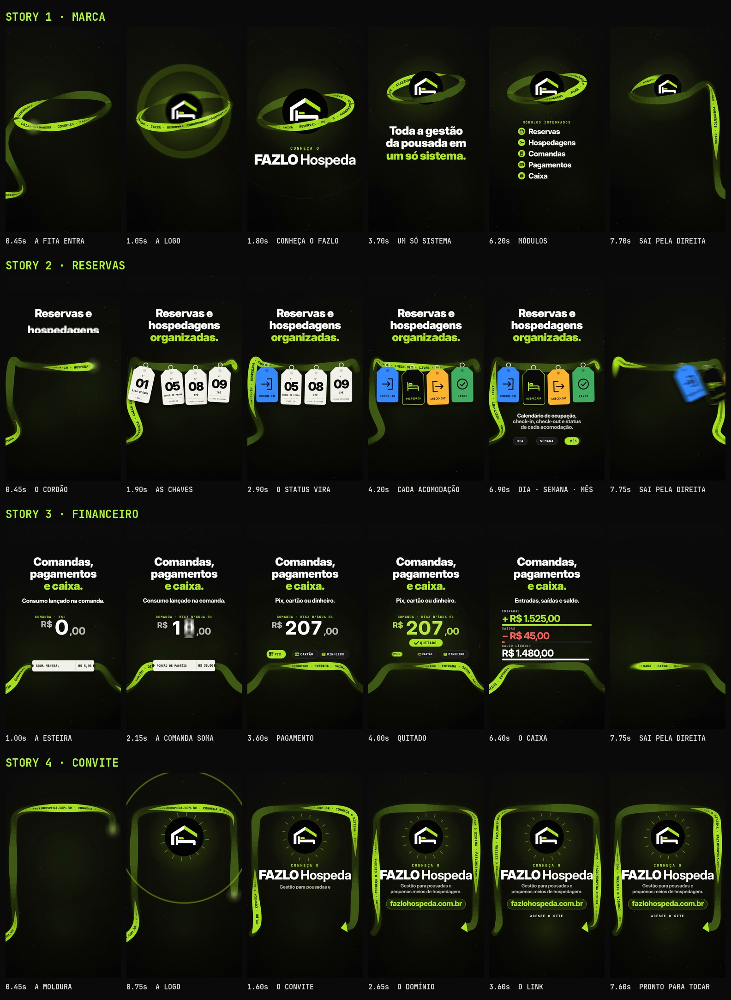

# FAZLO Hospeda — Stories · Destaque "Conheça"

Quatro Stories independentes e complementares para o Destaque permanente **"Conheça"** do Instagram, mais a capa exclusiva do Destaque. Projeto novo, em pasta própria: os Reels 00, 01 (v2) e 02 continuam intactos.

**Formato:** 9:16 (1080×1920), **4 × 8 s**, 60 fps, H.264 + AAC 48 kHz, áudio em −14 LUFS.

| | Story | Vídeo |
|---|---|---|
| 1 | **A marca** — "Conheça o FAZLO Hospeda. Toda a gestão da pousada em um só sistema." | [`output/conheca-01-marca.mp4`](output/conheca-01-marca.mp4) |
| 2 | **Reservas e hospedagens organizadas** — status de cada acomodação, calendário dia/semana/mês | [`output/conheca-02-reservas.mp4`](output/conheca-02-reservas.mp4) |
| 3 | **Comandas, pagamentos e caixa** — consumo na comanda, Pix/cartão/dinheiro, entradas/saídas/saldo | [`output/conheca-03-financeiro.mp4`](output/conheca-03-financeiro.mp4) |
| 4 | **Convite** — fazlohospeda.com.br, com espaço livre para o adesivo de link | [`output/conheca-04-convite.mp4`](output/conheca-04-convite.mp4) |

▶ **Sequência contínua para revisão (32 s):** [`output/conheca-sequencia-revisao.mp4`](output/conheca-sequencia-revisao.mp4)
⭘ **Capa do Destaque:** [`output/capa-destaque-conheca.png`](output/capa-destaque-conheca.png) (1080×1080) · versão Story [`output/capa-destaque-conheca-story.png`](output/capa-destaque-conheca-story.png) (1080×1920)
🖼 Storyboard: [`output/storyboard.jpg`](output/storyboard.jpg) · Revisão: [`output/revisao/`](output/revisao)



---

## Conceito: a fita

Um único elemento costura os quatro Stories: **a fita**, uma faixa verde-limão com texto impresso que gira em 3D (frente limão, verso oliva) enquanto corre pela tela. Em cada Story ela assume um papel diferente, e é sempre ela que conduz o olhar:

| Story | A fita vira… | O que se vê |
|---|---|---|
| 1 · marca | **o anel planetário da logo** | Entra pela esquerda, dá uma volta e um terço em torno da logo (passando por trás dela e depois pela frente), sobe com a marca e, no fim, desenrola pela direita. Os cinco módulos saem do anel como faíscas e se desdobram numa lista. |
| 2 · reservas | **o cordão de um chaveiro de recepção** | Quatro etiquetas de acomodação deslizam pelo cordão (da direita para a esquerda, sem se cruzar) e balançam ao parar. Uma a uma, elas viram e mostram o status no verso, com ícone e a cor da legenda do calendário. |
| 3 · financeiro | **uma esteira** | Os itens consumidos chegam pela esteira como tickets, param e sobem para a comanda, cujo total é um odômetro que gira. Depois de Pix, cartão ou dinheiro, a comanda é **quitada** e o valor desce para a esteira e segue para o caixa: entradas, saídas e saldo líquido. |
| 4 · convite | **uma moldura que aponta** | A fita desenha a moldura do convite e termina numa seta apontando para a área do adesivo de link. |

**Continuidade:** a fita sai de cada Story pela direita e entra no seguinte pela esquerda, sempre na mesma altura (a "pista", y = 1588), com o mesmo fundo, a mesma luz e as mesmas partículas. Assistidos em sequência no Destaque, os quatro parecem um só movimento; isolados, cada um começa e termina completo. A música também emenda: é uma única peça de 32 s, cortada nos limites dos compassos.

**Animações sem repetir os Reels:** nada de telhado/casa (Reel 00), ciclo da estadia (Reel 01) ou tabuleiro 3D (Reel 02). Fita torcida, anel planetário, chaveiro com etiquetas que viram, esteira de tickets, odômetro e moldura são novos na série.

## O que cada Story afirma (e de onde vem)

Só funções que existem no produto, conferidas nas capturas do app (incluindo as novas de **Comandas** e **Controle de Caixa**, usadas apenas como referência; nenhuma tela é reproduzida):

| Story | Afirmação | Base no app |
|---|---|---|
| 1 | Reservas, hospedagens, comandas, pagamentos e caixa num só sistema | Os módulos do produto |
| 2 | Calendário de ocupação, check-in, check-out e status de cada acomodação; visões dia/semana/mês | Calendário e legenda de status (check-in, hospedada, check-out, livre…), visões Dia · Semana · Mês |
| 3 | Consumo lançado na comanda; Pix, cartão ou dinheiro; entradas, saídas e saldo | Lançamento rápido de consumo e "Adicionar à comanda"; métodos Pix/Cartão/Dinheiro do diário de caixa; status "Quitado"; "Caixa de hoje" (entradas, saídas, saldo líquido). A política de caixa do app diz que a liquidação da comanda no check-out cai automaticamente como entrada no caixa — é o que o valor quitado descendo para a esteira mostra. |
| 4 | Gestão para pousadas e pequenos meios de hospedagem · fazlohospeda.com.br | Posicionamento e domínio oficiais |

**Dados:** acomodações (Bica D'Água 01, Chalé de Pedra 05, Ipê 08 e 09), tipos (Casal, Família, Casal Standard), itens e preços do cardápio (Água Mineral R$ 5, Cerveja Artesanal R$ 14, Porção de Pastéis R$ 38, Passeio Guiado R$ 150) e o caixa do dia (+R$ 1.525,00 / −R$ 45,00 / R$ 1.480,00) são os **dados de demonstração** das capturas, como ilustração. **Nenhum nome de pessoa** aparece. Não há datas, prazos, promoções nem nada que envelheça: o conteúdo fica permanente no Destaque.

## Roteiro (120 BPM · 1 compasso = 2 s · cada Story = 4 compassos)

### Story 1 · A marca (Mi – Dó#m – Lá – Si)

| Tempo | O que acontece |
|---|---|
| 0–1,0 s | A fita entra pela pista da esquerda, sobe e começa a orbitar. Intro sem bateria: pad, arpejo filtrado, subida. |
| 1,0 s | **A logo** surge no centro do anel com uma onda de choque; a banda entra junto, com a **sineta da série** (em Sol#, a terça de Mi). **"CONHEÇA O / FAZLO Hospeda"** |
| 2,35–3,0 s | Marca e anel sobem para o topo. |
| 3,0–4,1 s | **"Toda a gestão / da pousada em / um só sistema."** — uma linha por colcheia, cada uma com um acorde. |
| 4,5–5,9 s | **"MÓDULOS INTEGRADOS"**: uma faísca sai do anel para cada módulo — **Reservas, Hospedagens, Comandas, Pagamentos, Caixa** —, que se desdobra como uma aba; as notas sobem a pentatônica. |
| 7,25–8 s | A lista sai, a logo encolhe e o anel desenrola pela pista da direita. |

### Story 2 · Reservas e hospedagens (Dó#m – Lá – Mi – Si)

| Tempo | O que acontece |
|---|---|
| 0–1,0 s | A fita entra pela esquerda e vira o cordão do chaveiro. **"Reservas e / hospedagens / organizadas."** |
| 1,0–1,75 s | Etiquetas **09 · 08 · 05 · 01** deslizam pelo cordão e balançam (som de chapinhas de metal). |
| 2,5–3,75 s | Cada etiqueta vira (uma por colcheia) e revela o status: **CHECK-IN** (azul), **HOSPEDADA** (preto e limão), **CHECK-OUT** (amarelo), **LIVRE** (verde). |
| 4,5–5,0 s | **"Calendário de ocupação, / check-in, check-out e status / de cada acomodação."** |
| 5,5–7,2 s | Visões do calendário: **DIA · SEMANA · MÊS**; o destaque percorre as três. |
| 7,2–8 s | As etiquetas são levadas pelo cordão para a direita. |

### Story 3 · Comandas, pagamentos e caixa (Lá – Si – Sol#m – Dó#m)

| Tempo | O que acontece |
|---|---|
| 0–0,8 s | A fita vira esteira. **"Comandas, / pagamentos / e caixa."** |
| 0,8–3,0 s | **"Consumo lançado na comanda."** "COMANDA · BICA D'ÁGUA 01": quatro tickets chegam pela esteira, param e sobem; a cada um, o odômetro gira (R$ 5 → 19 → 57 → **207,00**) com uma moeda. |
| 3,0–3,75 s | **"Pix, cartão ou dinheiro."** — as três formas de pagamento. |
| 3,75 s | **✓ QUITADO** (arpejo de sinos). |
| 4,25–4,8 s | O valor quitado desce para a esteira e segue para o caixa. |
| 4,75–6,3 s | **"Entradas, saídas e saldo."** **+R$ 1.525,00 · −R$ 45,00 · R$ 1.480,00**, cada barra com um tom que sobe (ou desce, na saída). |
| 7,2–8 s | O caixa sai, a esteira se recolhe pela direita. |

### Story 4 · Convite (Lá – Si – Mi – Mi)

| Tempo | O que acontece |
|---|---|
| 0–1,5 s | A fita entra pela esquerda e desenha uma moldura; termina numa seta apontando para a área do link. |
| 0,5 s | **A logo**, com raios e a sineta da série. |
| 1,0–2,0 s | **"CONHEÇA O / FAZLO Hospeda"** · "Gestão para pousadas e / pequenos meios de hospedagem." |
| 2,0 s | **fazlohospeda.com.br** se escreve numa pílula limão. |
| 2,75 s | **"ACESSE O SITE"** e, logo abaixo, a **área livre para o adesivo de link** (y 1360–1530, sem nenhum texto ou elemento por cima). |
| 3–8 s | Tudo fica de pé para o toque, mas vivo: a fita corre, a seta pulsa no tempo, um brilho atravessa o domínio a cada 2 compassos e a música resolve em Mi. |

**Adesivo de link:** no Instagram, adicione o adesivo **Link** com `https://fazlohospeda.com.br` e posicione-o centralizado na faixa entre "ACESSE O SITE" e a base da moldura (y ≈ 1360–1530 de 1920, logo acima do campo de resposta). A seta da fita aponta para lá.

## Capa do Destaque

Exclusiva do Destaque: **a logo oficial dentro do anel da fita** (o mesmo símbolo do Story 1), sobre preto com halo limão. O anel contorna a logo **sem cobri-la** (a menor distância do anel ao centro é maior que o raio da logo) e a metade de trás fica em oliva, a da frente em limão, para ler como 3D mesmo pequena. Tudo cabe no círculo central: o anel externo da imagem é só fundo. Testada em 300, 160, 96 e 64 px, em fundo claro e escuro ([`capa-destaque-preview.jpg`](output/revisao/capa-destaque-preview.jpg)). Nome do Destaque: **Conheça**.

Para usar: no Instagram, *Editar Destaque → Editar capa → galeria* e escolha `capa-destaque-conheca.png` (ou publique `capa-destaque-conheca-story.png` como Story e use-o como capa).

## Direção de arte

- **A fita:** spline Catmull-Rom reamostrada por comprimento de arco; a largura projetada é `w·cos φ`, com `φ = fase + s·torção`, então ela afina até ficar de perfil e mostra o verso. O tom acompanha `|cos φ|` (luz), e o texto impresso acompanha a curva e a torção, letra a letra. Passes de profundidade deixam a fita passar por trás e pela frente da logo.
- **Cores:** preto, verde-limão `#AFFA27` e branco da marca; cores de status do próprio app nas etiquetas; vermelho só nas saídas do caixa.
- **Tipografia:** Inter Display nos títulos, JetBrains Mono nos dados.
- **Logo:** o arquivo oficial, sem alteração (`scripts/logo_alpha.py` só torna transparente o branco *fora* do círculo).
- **Sem prints, telas, celulares ou computadores.** Etiquetas, tickets, comanda e barras são peças gráficas.
- **Legível sem som:** toda ideia está escrita na tela (títulos de 106 px, legendas de 50–54 px, nada de informação só no áudio).
- **Áreas seguras:** nenhum texto nos 270 px do topo (barra de progresso e perfil) nem abaixo de 1650 px (campo de resposta).
- **Motion blur real** por subamostragem (12 amostras nas passagens rápidas).

## Som

Trilha e efeitos **sintetizados do zero** em Python (numpy/scipy), sem samples, numa linguagem nova na série: **nu-disco a 120 BPM em Mi maior** — bumbo reto, contratempo de chimbal aberto, baixo em oitavas, piano elétrico FM em acordes sincopados e arpejo em semicolcheias.

- **A fita tem um som:** sopro + tecido tremulando (ruído modulado a ~26 Hz) com um brilho agudo; entra pela esquerda do estéreo e sai pela direita, junto com a imagem.
- **Marca:** a sineta de recepção da série, afinada em Sol# (a terça de Mi), no Story 1 e no Story 4.
- **Story 1:** intro sem bateria até a logo; cada linha da frase é um acorde; cada módulo, uma nota subindo.
- **Story 2:** chapinhas de metal nas etiquetas; cada virada é uma nota do acorde; cliques nas trocas dia/semana/mês.
- **Story 3:** papel e baque nos tickets, moeda e "tique" do odômetro a cada item, arpejo de sinos no "quitado", tons que sobem nas barras do caixa.
- **Story 4:** sineta, *blips* subindo no domínio, brilho a cada 2 compassos e resolução na tônica.
- **Sincronia:** a animação exporta `audio/cues.json` (78 eventos nos 4 Stories) e `audio.py` coloca cada efeito exatamente nesses instantes.
- **Master (cada Story):** −14 LUFS integrado, com limitador de pico real (sobreamostragem 4×) para o MP4 ficar abaixo de −1 dBTP mesmo depois do AAC.

## Revisão

`python3 scripts/qa.py` gera [`relatorio-tecnico.txt`](output/revisao/relatorio-tecnico.txt), [`sincronia.txt`](output/revisao/sincronia.txt), [`zonas-seguras.jpg`](output/revisao/zonas-seguras.jpg), [`continuidade.jpg`](output/revisao/continuidade.jpg) e [`capa-destaque-preview.jpg`](output/revisao/capa-destaque-preview.jpg).

**Técnica (aprovada):** os 4 Stories em 1080×1920, 60 fps (480 quadros cada), H.264 High yuv420p, AAC 48 kHz estéreo, **8,000 s** de vídeo e de áudio; loudness de **−13,8 a −13,9 LUFS** e pico real entre **−2,1 e −3,2 dBTP** no MP4; sem quadros pretos nem imagem congelada. O vídeo de revisão tem 32,000 s, −13,9 LUFS e −2,2 dBTP.

**Sincronização (aprovada), em três camadas, Story a Story:**

1. o áudio de cada MP4 é a trilha do seu Story, sem deslocamento (0,0 ms em três pontos de cada um);
2. o ataque de 27 efeitos-chave, medido no áudio final (logo e sineta, módulos, chaveiro, viradas de status, trocas dia/semana/mês, tickets, moedas, "quitado", link), cai no instante do evento visual: **desvio máximo de 6,8 ms** em todos, menos de meio quadro (16,7 ms). Os efeitos menores na mesma grade de colcheias vêm do mesmo `cues.json`;
3. a imagem reage nos golpes principais (logo, viradas das etiquetas, "quitado", a descida do valor para a esteira).

**Visual (aprovada):**

- **áreas seguras:** nenhum texto nos 270 px do topo nem abaixo de 1650 px ([`zonas-seguras.jpg`](output/revisao/zonas-seguras.jpg));
- **adesivo de link (Story 4):** a área central entre y 1370 e 1525 fica livre de 3,2 s ao fim — só fundo, halo e partículas;
- **continuidade:** a fita entra pela pista da esquerda no início dos 4 Stories e sai pela da direita no fim dos 3 primeiros; no Story 4 ela fica na tela apontando para o link ([`continuidade.jpg`](output/revisao/continuidade.jpg));
- **capa do Destaque:** tudo dentro do círculo com folga (a faixa de 45 px junto à borda é só fundo); legível de 300 a 64 px, em fundo claro e escuro.

Revisão quadro a quadro (com e sem motion blur) durante a produção. Ajustes feitos a partir dela:

- o verso das etiquetas saía espelhado; as etiquetas passavam umas por cima das outras ao chegar (agora vêm da direita para a esquerda) e a frente deixou de antecipar o status (a cor só aparece na virada);
- o Story 3 foi refeito: na primeira versão os itens caíam por cima do título e o gráfico ficava escondido atrás da fita; agora há esteira, odômetro e barras horizontais, com um ticket por vez na esteira;
- os módulos do Story 1 se cruzavam no voo; agora formam uma coluna alinhada e se desdobram no lugar;
- textos que saíam "desdigitando" agora saem subindo e sumindo;
- no Story 2 a fita saía da tela na altura do varal; agora desce pela direita até a pista, como nos outros;
- as viradas das etiquetas foram para a grade de colcheias (o status aparece no tempo da música), e o prato invertido antes da logo do Story 1 termina 40 ms antes do golpe para o ataque ficar limpo;
- a capa ganhou folga em relação à borda do círculo e o anel deixou de cobrir a logo.

## Arquivos-fonte

```
stories/conheca/
  src/
    index.html                 # preview (Stories 1–4 em sequência, com áudio) e página usada no render
    anim.js                    # TODO o motion: a fita, os 4 Stories, a capa do Destaque, cues de som
    assets/                    # logo oficial + a mesma logo sem o fundo branco externo
    fonts/                     # Inter Display + JetBrains Mono (licença OFL)
  scripts/
    render.cjs                 # cues | video | review | stills | cover (Chromium headless -> ffmpeg)
    audio.py                   # 4 trilhas + efeitos a partir de audio/cues.json, master
    logo_alpha.py              # recorte do fundo da logo (não altera a arte)
    storyboard.py              # storyboard a partir dos MP4
    qa.py                      # revisão técnica, visual e de sincronização
  audio/
    cues.json                  # eventos de som exportados da animação (por Story)
    story-01.wav … story-04.wav
  output/
    conheca-01-marca.mp4 … conheca-04-convite.mp4
    conheca-sequencia-revisao.mp4
    capa-destaque-conheca.png  capa-destaque-conheca-story.png
    storyboard.jpg
    revisao/
```

A animação é **determinística**: `STORIES.renderAt(ctx, n, t)` desenha o quadro exato do instante `t` do Story `n`.

### Como renderizar

Requisitos: Node 18+, Playwright (Chromium), ffmpeg, Python 3 com numpy, scipy e Pillow.

```bash
cd stories/conheca
node scripts/render.cjs cues                   # 1) eventos de som tirados da animação
python3 scripts/audio.py                       # 2) as 4 trilhas
node scripts/render.cjs video                  # 3) os 4 Stories em output/ (ou: video 2,3)
node scripts/render.cjs review                 # 4) sequência contínua para revisão
node scripts/render.cjs cover square           # 5) capa do Destaque (1080x1080)
node scripts/render.cjs cover story            #    e a versão 1080x1920
python3 scripts/storyboard.py                  # 6) storyboard
python3 scripts/qa.py                          # 7) revisão técnica, visual e de sincronização
node scripts/render.cjs stills 3 2.3,4.0       # (opcional) quadros avulsos do Story 3 em PNG
```

Preview interativo: sirva `stories/conheca` com qualquer servidor estático e abra `src/index.html` (botões 1–4; `?story=2&t=3.1` abre num instante; `?cover=square` mostra a capa).

### Onde editar

- **Tempo:** `BPM`, `DURATION` e os objetos `S1`…`S4` (instantes de cada Story) em `src/anim.js`.
- **A fita:** `RIB` (largura, texto), `ribbon()` (torção e luz) e os caminhos `s1Path`, `s2Path`, `s3Path`, `s4Path`. `LANE_Y`, `IN` e `OUT` definem a pista de continuidade.
- **Conteúdo:** módulos em `MODULES`, etiquetas em `TAGS`, itens da comanda em `ITEMS`, caixa em `CASH`, convite em `story4`.
- **Som:** mudar um tempo em `anim.js` e rodar `render.cjs cues` + `audio.py` já ressincroniza os efeitos. Harmonia e arranjo ficam em `scripts/audio.py` (`CH`, `PROG`, `build`).
