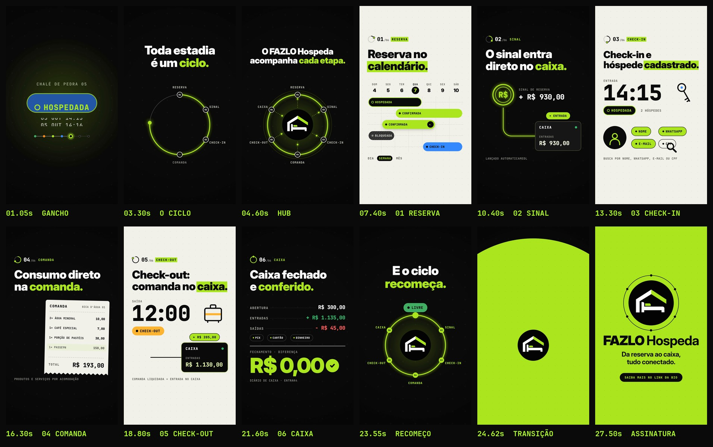

# FAZLO Hospeda: Reels v2, "O ciclo da estadia"

Segundo experimento, **independente do primeiro vídeo** (que continua intacto na raiz do repositório).
Desta vez o ponto de partida foram **capturas reais do produto e a logo oficial**. As telas serviram só para entender o produto e **não aparecem no vídeo**: não há prints, interfaces, celulares nem computadores. Tudo é feito com formas, ícones, tipografia e movimento.

**Formato:** 9:16 (1080×1920), **29 s**, 60 fps, H.264 + AAC, áudio em −14 LUFS.

▶ **Vídeo:** [`output/fazlo-hospeda-reels-v2.mp4`](output/fazlo-hospeda-reels-v2.mp4)
🖼 Capa: [`output/capa.png`](output/capa.png) · Storyboard: [`output/storyboard.jpg`](output/storyboard.jpg)



---

## O que as telas mostraram (e o vídeo usa)

| Tela | O que o produto faz de fato | Como virou motion |
|---|---|---|
| Calendário de ocupação | Visões **dia / semana / mês**, status por acomodação (**livre, pré-reserva, confirmada, check-in, hospedada, check-out, bloqueada**), horário de check-in/out, nº de hóspedes, código da reserva | A legenda de status é a **linguagem visual do vídeo**: a etiqueta que gira no gancho, as barras de estadia na semana e a pílula LIVRE do fim |
| Hóspedes | Cadastro com **busca por nome, WhatsApp, e-mail ou CPF** | Silhueta + quatro campos, com uma lupa passando por eles |
| Comandas | Lançamento rápido de consumo por acomodação: **produtos e serviços** (frigobar, cardápio, passeio) e quantidade | Uma comanda de papel que recebe itens (ícones que voam e viram linhas) |
| Caixa | Abertura e fechamento, entradas e saídas, **Pix, cartão e dinheiro**, diário de caixa. Política: **o sinal da reserva e a comanda liquidada no check-out entram automaticamente como ENTRADA**. Fechamento com **diferença** conferida | Linhas que levam o dinheiro até o bloco CAIXA, o placar de abertura/entradas/saídas e o fechamento **DIFERENÇA R$ 0,00** |

Nada fora disso é prometido: não há números de resultado, ganhos de tempo nem funções que as telas não mostram. Valores, nomes e horários são **ilustrativos** e saem dos dados de demonstração das próprias capturas (Bica D'Água 01, Chalé de Pedra 05, água R$ 5, pastéis R$ 38, passeio R$ 150, sinal R$ 930, check-in 14:15, abertura R$ 300, saída R$ 45 etc.).

## Conceito: "Toda estadia é um ciclo."

Toda hospedagem percorre o mesmo caminho: o quarto está **livre**, recebe uma **reserva**, o **sinal** é pago, o hóspede faz **check-in**, **consome**, faz **check-out**, o **caixa** fecha, e o quarto fica **livre** de novo.

O vídeo transforma esse caminho num **anel de 6 etapas** com a logo do FAZLO Hospeda no centro, como o eixo que acompanha todas elas. A câmera mergulha em cada etapa e, no fim, sai de volta ao anel, que se fecha (*"E o ciclo recomeça."*) e se contrai em torno da logo. O círculo do ciclo rima com o círculo da marca.

Assinatura: **"Da reserva ao caixa, tudo conectado."**, que resume a integração real entre reservas, comandas e caixa.

## Direção de arte

- **Identidade:** preto, verde-limão `#AFFA27` (amostrado da logo) e branco, as cores do produto. As cenas alternam **escuro / claro** a cada etapa para dar ritmo, e o verde-limão fica reservado para o que importa: destaques, o ponto que percorre o ciclo e o fundo da assinatura.
- **Cores de status do próprio app**, usadas com a mesma função: verde (livre), laranja (pré-reserva), limão (confirmada), azul (check-in), preto com contorno limão (hospedada), âmbar (check-out), cinza (bloqueada), verde e vermelho para entradas e saídas.
- **Tipografia em dupla, como no produto:** grotesca pesada (*Inter Display Black*) nos títulos e **monoespaçada** (*JetBrains Mono*) nos dados, etiquetas, horários e valores.
- **Elementos:** o ponto da legenda, o anel, pílulas de status, linhas de fluxo com brilho, contadores que rolam, ícones de traço contínuo e marca-texto limão nos fundos claros. Estilo editorial e preciso, de propósito diferente do neobrutalismo colorido do v1.
- **Logo:** usada **como foi fornecida**. O script `scripts/logo_alpha.py` só torna transparente o branco **fora** do círculo, para a logo assentar sobre fundo preto ou verde. Nada é redesenhado.

## Roteiro (120 BPM)

| Tempo | Cena | O que acontece |
|---|---|---|
| 0–2,3 s | **Gancho** | "CHALÉ DE PEDRA 05". Uma etiqueta de status gira em colcheias: LIVRE → PRÉ-RESERVA → CONFIRMADA → CHECK-IN → HOSPEDADA → CHECK-OUT → LIVRE, enquanto a data e a hora avançam (04 OUT 08:00 → 07 OUT 12:05). Uma estadia inteira em 1,5 s. |
| 2–5,3 s | **O ciclo** | "Toda estadia é um ciclo." A etiqueta vira um ponto, que desenha o anel e acende as 6 etapas. No *drop* (4 s), a logo entra no centro, ligada às etapas por raios: "O FAZLO Hospeda acompanha cada etapa." A câmera mergulha no nó 01. |
| 5,3–8,5 s | **01 Reserva** | Semana de 4 a 10/out. Estadias deslizam nas trilhas com as cores de status; a pré-reserva laranja chega e vira **CONFIRMADA ✓**. DIA · SEMANA · MÊS. |
| 8,5–11 s | **02 Sinal** | Uma moeda R$ cai: sinal de reserva **+ R$ 930,00**. O pulso corre pela linha até o CAIXA: "Lançado automaticamente como entrada." |
| 11–14 s | **03 Check-in** | 14:15 rola no relógio, a chave gira, CHECK-IN vira **HOSPEDADA**. Cadastro do hóspede: a lupa passa por nome, WhatsApp, e-mail e CPF. |
| 14–17 s | **04 Comanda** | Água, café, porção de pastéis (produtos) e passeio guiado (serviço) voam para a comanda da Bica D'Água 01. Total: R$ 205,00. |
| 17–19,5 s | **05 Check-out** | 12:00, mala, CHECK-OUT. A comanda liquidada vira um pulso e entra no caixa (R$ 930 → R$ 1.135). |
| 19,5–22,6 s | **06 Caixa** | Abertura, entradas e saídas contam; Pix · Cartão · Dinheiro; a linha de fechamento e **DIFERENÇA R$ 0,00 ✓**: "Caixa fechado e conferido." |
| 22,6–24,5 s | **Recomeço** | Zoom para trás até o anel. O ponto fecha a volta, o quarto volta a **LIVRE**: "E o ciclo recomeça." O anel gira e se contrai na logo. |
| 24,5–29 s | **Assinatura** | O verde-limão inunda a tela a partir da logo. Órbita com as 6 etapas, **FAZLO Hospeda**, "Da reserva ao caixa, tudo conectado." e o CTA "Saiba mais no link da bio". |

Transições: **mergulho no nó** (íris) para entrar e sair do anel, e *whip pan* com desfoque de movimento real (10 amostras por quadro) entre as etapas, sempre para a esquerda, como quem avança no ciclo. Os textos importantes ficam fora das áreas cobertas pela interface do Reels.

## Som

Trilha e efeitos **sintetizados do zero** em Python (numpy/scipy), sem nenhum sample. A linguagem é outra em relação ao v1: em vez de house 4×4, um **groove quebrado (2-step)** com piano elétrico FM, marimba FM e um baixo com harmônicos, para que ele apareça em alto-falante de celular. A progressão é Fá♯m9 → Ré7M(9) → Lá7M(9) → Mi6/9 e **resolve em Lá maior** na assinatura, com um "botão" final.

- **Tique-taque de relógio** no gancho e nas cenas com horário (check-in e check-out).
- **Barra de progresso sonora:** cada etapa abre com um "ding" de marimba **um grau acima** do anterior (Dó♯ → Mi → Fá♯ → Sol♯ → Lá → Si), até a resolução.
- No gancho, cada troca de status toca uma nota da pentatônica, sempre subindo. O rastro do anel faz o som **girar no estéreo**.
- Efeitos sincronizados: moeda, pulso na linha, "caixa registrou", rolagem de dígitos, giro da chave, digitação, carimbo de confirmação, impactos e *risers*.
- Masterização em **−14 LUFS integrado / pico real ≤ −1 dBTP**, com `loudnorm` em duas passadas.

## Arquivos-fonte

```
v2/
  src/
    index.html                 # preview (play/scrub com áudio) e página usada no render
    anim.js                    # TODO o motion: cenas, ícones, tipografia, transições
    assets/fazlo-hospeda-logo.png        # logo original, como foi enviada
    assets/fazlo-hospeda-logo-alpha.png  # mesma logo, só sem o fundo branco externo
    fonts/                     # Inter Display + JetBrains Mono (licença OFL)
  scripts/
    audio.py                   # gera audio/trilha.wav (trilha + efeitos + loudness)
    logo_alpha.py              # recorte do fundo da logo (não altera a arte)
    storyboard.py              # storyboard e capa a partir do MP4
    render.cjs                 # renderiza quadro a quadro (Chromium headless) -> ffmpeg -> MP4
  audio/trilha.wav
  output/                      # vídeo final, capa e storyboard
```

A animação é **determinística**: `FAZLO2.renderAt(ctx, t)` desenha o quadro exato do instante `t`, então preview e render saem idênticos.

### Como renderizar

Requisitos: Node 18+, Playwright (Chromium), ffmpeg, Python 3 com numpy, scipy e Pillow.

```bash
cd v2
python3 scripts/logo_alpha.py                  # (só se trocar a logo)
python3 scripts/audio.py                       # 1) trilha sonora
node scripts/render.cjs video --fps 60         # 2) vídeo final em output/
node scripts/render.cjs stills 4.3,21.6        # (opcional) quadros avulsos em PNG
python3 scripts/storyboard.py                  # (opcional) storyboard + capa
```

### Preview interativo

```bash
npx serve v2        # ou qualquer servidor estático
# abra http://localhost:3000/src/index.html   (?t=12.5 abre num instante específico)
```

### Onde editar

- **Cores e status:** objetos `C` e `ST`, no topo de `src/anim.js`.
- **Textos e tempos de cada etapa:** funções `sceneOpen`, `st1`…`st6`, `sceneRing` e `sceneEnd`.
- **Cortes e transições:** `CUT` e `TRANS`, no fim de `anim.js`. Se mudar algum tempo, ajuste também os efeitos correspondentes em `scripts/audio.py` (as constantes `B = …` marcam o início de cada cena).
